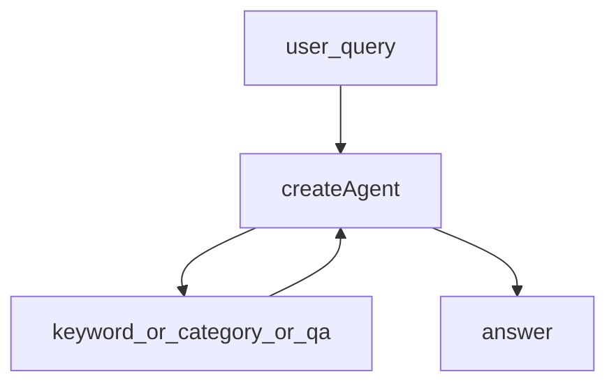

# 12.反应式智能体

下次要看「用户一问、Agent 自己选工具、马上答」的反应式架构时看这里。

私募规则演示库 + 三件查询工具。`createAgent` 自己决定先搜关键词、按类别，还是直接对问题。知识库没有就直说。

## 前置条件

- 仓库根目录 `.env`：`BAILIAN_TOKEN_PLAN_API_KEY`、`CHAT_BASE_URL`、`CHAT_MODEL`
- 密钥只进 `client.ts`，业务代码不读环境变量

## 使用方法

```bash
npm run agent:reactive
```

会问三句：合格投资者、风险准备金（应命中知识库）、向不特定对象公开宣传（库里没有，应明确说没有）。



## 目录架构

```text
12.反应式智能体/
  client.ts    ChatOpenAI（Token Plan）
  rules.ts     三条演示规则
  agent.ts     三件工具 + createAgent
  index.ts     三问演示
```

## 查阅要点

- does: 反应式 tool-calling Agent；工具只查内存规则；缺知识就承认
- not: 不做长期规划图；不接真监管库；不是混合式/深思熟虑（那是 13 / 14）
