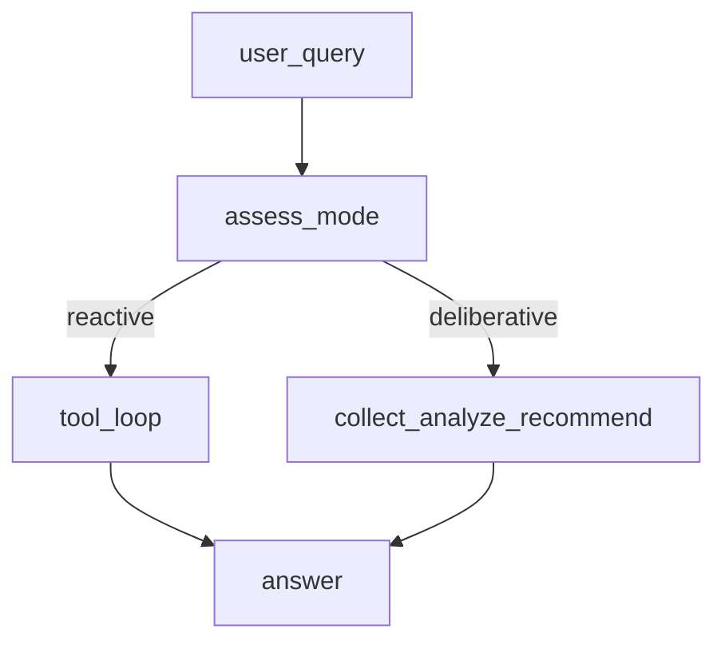

# 13.混合式智能体

下次要看「先评估再分流」的混合架构时看这里：简单问走工具环，复杂问走收集-分析-建议。

协调层判断 `reactive` / `deliberative`。行情、配置、新闻是写死的模拟数据。

## 前置条件

- 仓库根目录 `.env`：`BAILIAN_TOKEN_PLAN_API_KEY`、`CHAT_BASE_URL`、`CHAT_MODEL`
- 密钥只进 `client.ts`，业务代码不读环境变量

## 使用方法

```bash
npm run agent:hybrid
```

先问上证指数（应走 reactive 并打出工具调用），再问组合如何应对经济放缓（应走 deliberative）。控制台会打印 `processing_mode`。



## 目录架构

```text
13.混合式智能体/
  client.ts    ChatOpenAI
  sample.ts    一份客户画像
  tools.ts     模拟指数 / 配置 / 新闻
  graph.ts     LangGraph 评估分流
  index.ts     两问演示
```

## 查阅要点

- does: 评估后分支；reactive 用 createAgent 工具环；deliberative 三步 JSON/文本
- not: 不接真实行情；不是纯反应式（12）也不是五段投研（14）
