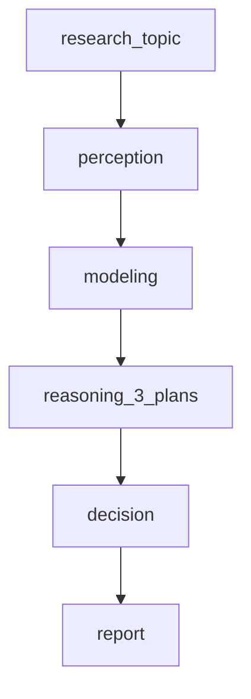

# 14.深思熟虑智能体

下次要看多步骤「感知-建模-推理-决策-报告」的投研 Agent 时看这里。

没有工具。每段结构化 JSON（报告是自然语言）。演示主题写死为半导体中期配置。终稿只打控制台，不写带日期的文件。

## 前置条件

- 仓库根目录 `.env`：`BAILIAN_TOKEN_PLAN_API_KEY`、`CHAT_BASE_URL`、`CHAT_MODEL`
- 密钥只进 `client.ts`，业务代码不读环境变量

## 使用方法

```bash
npm run agent:deliberative
```

控制台按 1–5 打印阶段，再给出市场状态、三个候选方案、选中方案和报告节选。会打多次模型，大约一两分钟。



## 目录架构

```text
14.深思熟虑智能体/
  client.ts    ChatOpenAI
  schema.ts    感知 / 建模 / 方案 / 决策的 zod
  graph.ts     五节点直线 LangGraph
  index.ts     固定主题演示
```

## 查阅要点

- does: 五段流水线；推理必须给多方案再决策；zod 验收 JSON
- not: 不调行情工具；不落盘 research_report_*.txt；不是反应式问答（12）
