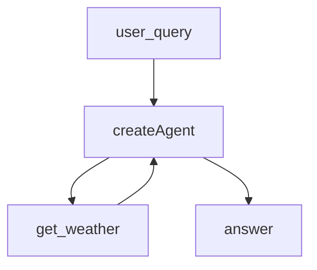

# 15.Langchain Agent

下次要用 LangChain 1.x 最小写法建 Agent（Node / Python 对照）时看这里。

`createAgent` / `create_agent` 配一件模拟天气工具。问天气就调工具，不接真实 API。

## 前置条件

- 仓库根目录 `.env`：`BAILIAN_TOKEN_PLAN_API_KEY`、`CHAT_BASE_URL`、`CHAT_MODEL`
- 密钥只进 `node/client.ts` 与 `python/client.py`，业务代码不读环境变量
- Python：3.10+，先 `pip install -r "exampleAgentFramework/15.Langchain Agent/python/requirements.txt"`

## 使用方法

```bash
npm run langchain-agent
npm run langchain-agent:py
```

两边都固定问「杭州今天天气怎么样？」。控制台打印问句和终答；终答应带上工具返回的晴、26°C。



## 目录架构

```text
15.Langchain Agent/
  node/
    client.ts    ChatOpenAI（Token Plan）
    agent.ts     get_weather + createAgent
    index.ts     固定问句
  python/
    client.py    ChatOpenAI（带 base_url）
    agent.py     get_weather + create_agent
    main.py      同一句固定问
    requirements.txt
```

## 查阅要点

- does: 官方最小 createAgent；一件模拟工具；Node / Python 对照
- not: 不接真天气；不用 initialize_agent / AgentExecutor；不是 12 反应式规则库
