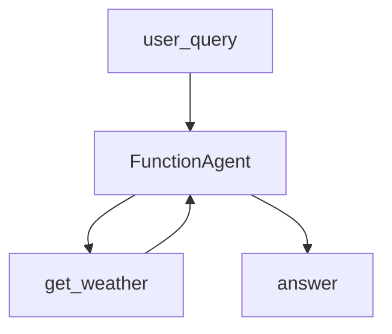

# 16.LlamaIndex

下次要用 LlamaIndex 最小写法建 Agent 时看这里。

`FunctionAgent` 配一件模拟天气工具。问天气就调工具，不接真实 API。

## 前置条件

- 仓库根目录 `.env`：`BAILIAN_TOKEN_PLAN_API_KEY`、`CHAT_BASE_URL`、`CHAT_MODEL`
- 密钥只进 `client.py`，业务代码不读环境变量
- Python 3.10+，先 `pip install -r exampleAgentFramework/16.LlamaIndex/requirements.txt`

## 使用方法

```bash
npm run llama-index-agent
```

固定问「杭州今天天气怎么样？」。控制台打印问句和终答；终答应带上工具返回的晴、26°C。



## 目录架构

```text
16.LlamaIndex/
  client.py           OpenAILike（Token Plan，function calling 打开）
  agent.py            get_weather + FunctionAgent
  main.py             固定问句
  requirements.txt
```

## 查阅要点

- does: LlamaIndex FunctionAgent；OpenAI 兼容端点；一件模拟工具
- not: 不接真天气；不是 ReAct 长链路；不是 15 LangChain / 17 Qwen-Agent
