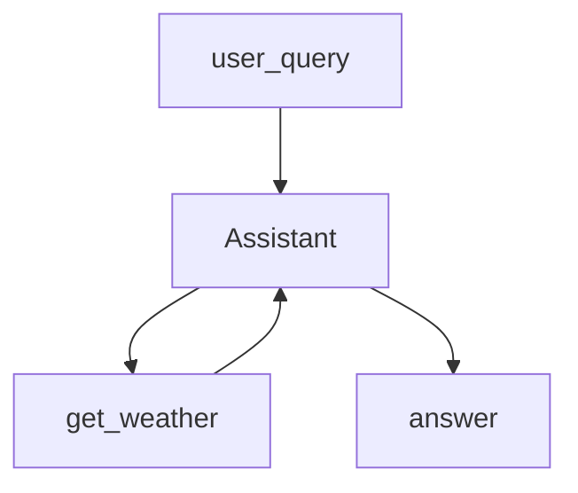

# 17.Qwen-Agent

下次要用 Qwen-Agent 最小写法建 Assistant 时看这里。

`Assistant` + `@register_tool` 配一件模拟天气工具。走 OpenAI 兼容 `model_server`，不走 DashScope 专用类型。

## 前置条件

- 仓库根目录 `.env`：`BAILIAN_TOKEN_PLAN_API_KEY`、`CHAT_BASE_URL`、`CHAT_MODEL`
- 密钥只进 `client.py`，业务代码不读环境变量
- Python 3.10+，先 `pip install -r exampleAgentFramework/17.Qwen-Agent/requirements.txt`

## 使用方法

```bash
npm run qwen-agent
```

固定问「杭州今天天气怎么样？」。控制台打印问句和终答；终答应带上工具返回的晴、26°C。



## 目录架构

```text
17.Qwen-Agent/
  client.py           llm_cfg（model / model_server / api_key）
  agent.py            register_tool + Assistant
  main.py             固定问句
  requirements.txt
```

## 查阅要点

- does: Qwen-Agent Assistant；自定义工具；Token Plan 当 OpenAI 兼容服务
- not: 不用 model_type qwen_dashscope；不挂 code_interpreter / MCP / 文档 RAG
