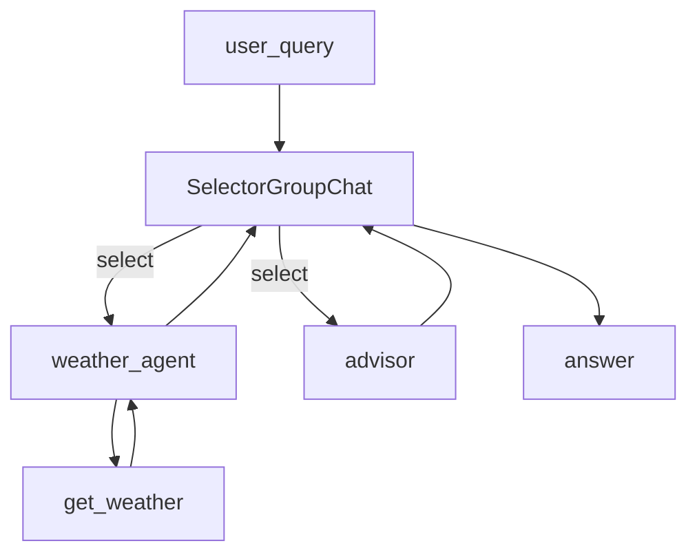

# 18.AutoGen

下次要看 AutoGen 群聊（模型选下一个说话人）时看这里。

`SelectorGroupChat` 里两个角色：天气助手调模拟工具，顾问根据实况给出行建议。

## 前置条件

- 仓库根目录 `.env`：`BAILIAN_TOKEN_PLAN_API_KEY`、`CHAT_BASE_URL`、`CHAT_MODEL`
- 密钥只进 `client.py`，业务代码不读环境变量
- Python 3.10+，先 `pip install -r exampleAgentFramework/18.AutoGen/requirements.txt`

## 使用方法

```bash
npm run autogen-agent
```

固定问「杭州今天天气怎么样？」。控制台按轮打印 `[weather]` / `[advisor]`；应能看到工具返回的晴、26°C，顾问建议末尾带 `TERMINATE`。



## 目录架构

```text
18.AutoGen/
  client.py           OpenAIChatCompletionClient + ModelInfo
  agent.py            两角色 + SelectorGroupChat
  main.py             固定问句，打印各轮发言
  requirements.txt
```

## 查阅要点

- does: SelectorGroupChat；两角色；模拟天气工具
- not: 不是单 AssistantAgent；不用旧 UserProxy / GroupChatManager；不是 Magentic-One
