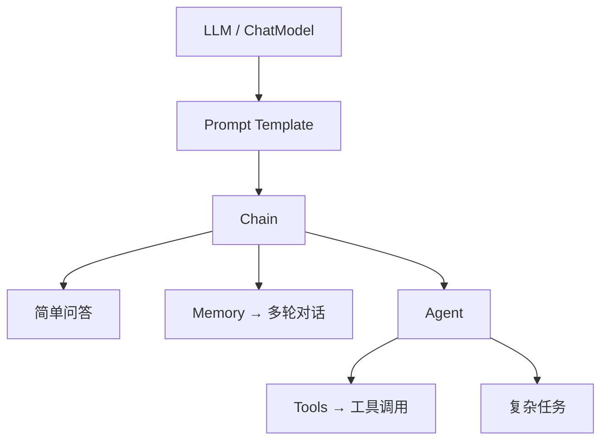

# LangChain · 知识点

LangChain 是编排框架：把 Prompt、模型、检索、工具按固定顺序串成链，或交给 Agent 在循环里自己选工具。

Chain = 写死的流水线（如 `prompt | llm`）。Agent = 模型决定下一步调哪个工具。

## [重点] LangChain 由哪些组件组成？

六块，对应「怎么问、谁来答、记得什么、知识从哪来、怎么串、要不要自己选工具」。

1. **Models** — 聊天 / 补全 / Embedding，例如 GPT-4o。换模型不换整条业务链。
2. **Prompts** — 模板、管理和序列化。变量填进去再交给模型。
3. **Memory** — 保存和模型交互的上下文（多轮对话）。没有它每次都是新会话。
4. **Indexes** — 知识库这条线：加载、转换、切长文、向量化、索引存储和查询。要自建知识库就走这里。
5. **Chains** — 把上面组件按固定顺序调用，例如检索 → 填 Prompt → 调模型。
6. **Agents** — 模型自己决定调哪个工具、看结果、再决定下一步，直到结束。

## LangChain 整体架构怎么串？

核心不是六块并列，而是 **Prompt 填好 → 模型说话 → Chain 往下传**。Chain 有三条出路：直接答、挂 Memory 做多轮、挂 Agent 去调工具。

| 组件            | 干什么                                        |
| --------------- | --------------------------------------------- |
| LLM / ChatModel | LLM 做补全；ChatModel 做对话，能 tool calling |
| Prompt Template | 变量填进模板，变成模型能吃的 prompt           |
| Chain           | 组件串联，如 `prompt \| llm`，数据依次流过    |
| Memory          | 存对话历史，多轮                              |
| Agent           | 按问题自己决定调哪些工具                      |
| Tools           | 搜索、计算、查库等，给 Agent 用               |



Indexes 是知识库那条线，图上没画进核心黄框：检索结果通常先填进 Prompt，再进这条链。

## LangChain 的核心优势是什么？

不是模型更聪明，是**积木多、拼法统一**。换模型、换向量库、挂工具，业务链不用重写。

1. **生态** — 模型、向量库、预置工具都多（官方口径 100+ 模型、50+ 向量库），接得上就少自己包一层。
2. **LCEL** — `|` 链式调用，同一条链 `invoke` / `stream` / `batch` / 异步都能用。
3. **`@tool`** — 函数名 + docstring + 类型注解，注册工具最省样板。
4. **记忆** — `session_id` 隔开多用户，并发不会串历史。

| 场景             | 说明                               |
| ---------------- | ---------------------------------- |
| 工具调用型 Agent | 网络诊断、查数、调 API，多工具协作 |
| 多轮对话         | 客服、助手，要记住上下文           |
| 复杂流程编排     | LCEL 拼多步流水线；有环再上图      |
| 快速原型         | 组件库够用，先搭 POC               |

## LangChain 里常用的 Tools 有哪些？

Agent 不会「自带神通」，能力来自挂上的工具：模型选出名字和参数，运行时去调，把返回值再喂回模型。预置多在 `langchain-community`，多数要 API Key。常见组合是搜索 + REPL + 一个业务 API；具体名字见下表。

| 工具               | 分类      | 说明                                                 |
| ------------------ | --------- | ---------------------------------------------------- |
| DuckDuckGo Search  | 联网搜索  | 免 Key 网页搜索                                      |
| Bing Search        | 联网搜索  | 必应搜索                                             |
| Google Search      | 联网搜索  | Google 搜索，要 Key                                  |
| Google Serper API  | 联网搜索  | 经 Serper 调 Google，比官方接口省事                  |
| SerpAPI            | 联网搜索  | 聚合搜索引擎结果                                     |
| SearxNG Search API | 联网搜索  | 自建/开源元搜索                                      |
| Metaphor Search    | 联网搜索  | 语义搜索（后来的 Exa）                               |
| Wikipedia          | 垂直检索  | 查百科条目                                           |
| YouTubeSearchTool  | 垂直检索  | 搜视频标题/链接                                      |
| ArXiv API Tool     | 垂直检索  | 搜论文预印本                                         |
| Google Places      | 垂直检索  | 查地点、商户                                         |
| Requests           | 调接口    | 发 HTTP 请求                                         |
| GraphQL tool       | 调接口    | 调 GraphQL API                                       |
| AWS Lambda API     | 调接口    | 触发 Lambda                                          |
| Zapier             | 调接口    | 自然语言驱动 Zapier 自动化                           |
| IFTTT WebHooks     | 调接口    | 触发 IFTTT 场景                                      |
| OpenWeatherMap API | 业务插头  | 查天气                                               |
| Twilio             | 业务插头  | 发短信 / 打电话                                      |
| Apify              | 业务插头  | 网页抓取、爬虫 Actor                                 |
| ChatGPT Plugins    | 业务插头  | 接 ChatGPT 插件（老生态）                            |
| Shell Tool         | 本机      | 执行系统命令                                         |
| File System Tools  | 本机      | 读写本地文件                                         |
| Python REPL        | 本机      | 跑 Python、算数                                      |
| Wolfram Alpha      | 计算      | 精确计算、公式、知识问答                             |
| Human as a tool    | 人在环路  | 拿不准就问真人                                       |
| HuggingFace Tools  | 模型/界面 | 调 HF 上的模型当工具                                 |
| Gradio Tools       | 模型/界面 | 把 Gradio 应用当工具                                 |
| SceneXplain        | 多模态    | 图片场景描述                                         |
| **自定义 Tool**    | 自研      | 名字 + 中文说明 + 参数 schema + 函数。没有的就自己包 |

## LangChain 里短期记忆有哪几种？

多轮对话要把「刚才说了什么」塞进下次 Prompt。四种都是**这一次会话里**怎么带历史，不是跨用户的长期记忆。有的材料写成 `ConversionMemory`，类名其实是 `ConversationSummaryMemory`。

| 类名                          | 怎么记   | 塞进 LLM 的是什么                             | 适合 / 坑                                |
| ----------------------------- | -------- | --------------------------------------------- | ---------------------------------------- |
| **BufferMemory**              | 全量缓冲 | 从开头到现在的**全部**对话原文                | 短聊最准；轮次一长必爆窗口               |
| **BufferWindowMemory**        | 滑动窗口 | 最近 **K 组**问答                             | 只关心刚才几轮；K 之外的事实会忘         |
| **ConversationSummaryMemory** | 摘要     | 用模型把历史**压成摘要**再传入                | 长对话省 token；摘要会丢细节、多一次 LLM |
| **VectorStore-backed Memory** | 向量召回 | 历史写入向量库，按当前问题检索最像的 **K 段** | 只想起相关的旧话；不相关的近况可能捞不着 |

## 内存和上下文是什么关系？

Memory 不是模型外面另有一个大脑，而是把历史**写进这次 Prompt 的上下文**。Agent / Chain 先从 Memory 取出对话，填进模板变量，再交给 LLM。没有这一步，每轮都是新会话。

全量历史用 `ConversationBufferMemory`（表里的 BufferMemory）：

```python
memory = ConversationBufferMemory(memory_key="chat_history")
```

`memory_key` 必须和 Prompt 里的占位符同名。模板写 `{chat_history}`，这里就要 `chat_history`，对不上就等于没带上轮。

1. **存** — 每轮 user / assistant 追加进 buffer。
2. **取** — 下次调用把整段 `chat_history` 拼进 Prompt。
3. **坑** — 轮次一长，上下文被历史占满，新问题反而被挤掉；这时改窗口或摘要，不是再把 key 改个名。

## LangChain 0.3 到 1.x 有什么变化？

三条线：包拆开、官方子项目、写法改成 LCEL。0.3 并不是「没有链了」——组件还在，依赖和 API 变了。

1. **包结构拆开**
   - `langchain-core`：抽象基类 + **LCEL**。第三方集成不要再依赖整包 `langchain`。
   - `langchain-community`：社区维护的 loader、retriever、tool。
   - 厂商包独立：`langchain-openai`、`langchain-anthropic`，体积小、升级互不影响。

2. **官方子项目**
   - **LangGraph**：用图编排多步、多角色、有状态的工作流，替代多重 Chain 嵌套。
   - **LangServe**：链 / Agent 一键变成 REST（`/invoke`、`/stream`、`/batch` + Swagger）。
   - **LangSmith**：调试、回归、在线监控，和回调打通。

3. **API 转向 LCEL** — 用 `|` 把组件拼成 Runnable，例如 `prompt | llm`，不再靠继承 `Chain` 基类。

## [重点] 怎么用 LCEL 构建任务链？

LCEL = LangChain Expression Language。1.x 用 `|` 把 Prompt、Model、Memory、Retriever 等 **Runnable** 拼成管道：左边的输出自动当右边的输入。

数据流：用户输入 → `PromptTemplate` → `ChatModel` → `OutputParser` → 结构化输出。

```python
from langchain_core.prompts import PromptTemplate
from langchain_community.llms import Tongyi

llm = Tongyi(model_name="qwen-turbo", dashscope_api_key=api_key)
prompt = PromptTemplate(
    input_variables=["product"],
    template="What is a good name for a company that makes {product}?",
)

chain = prompt | llm
result = chain.invoke({"product": "colorful socks"})
chain.stream({"product": "colorful socks"})   # 边生成边吐
```

`invoke` 的 dict key 必须和 `input_variables` 同名。要解析再 `| parser`。

1. **串联** — `A | B | C`：A 的输出进 B，B 的进 C。最常见是 `prompt | llm | parser`。
2. **分支 / 并行** — 写成字典 `{"x": A, "y": B}`，A 和 B 同时跑，总耗时约等于慢的那路，不是相加。
3. **统一接口** — 整条链都是 Runnable：`invoke` 一次、`stream` 流式、`batch` 批量，不用为流式再改内部。

好处：少嵌套胶水、子链能拆出来复用和调试。有循环、要持久化状态，再用 LangGraph，不要用 `|` 硬套。

---

## 1. 问答链解决什么

RAG 后半段：召回 → **组装上下文** → 生成。问答链只做后两步，不管怎么切、怎么检索。

问题可以想成：检索回来 5 段文档，接下来怎么问模型。

和检索里的 **rerank** 不是一回事：检索 rerank 是「哪几段更相关」；`map_rerank` 是「每段都让 LLM 答一遍，再挑最有把握的答案」。

---

## 2. 四种策略

### 2.1 stuff（塞进去）

把全部 chunk 拼进**同一次** prompt，调 **1 次** LLM。

```text
chunk1 + chunk2 + … + chunkN  →  Prompt Context  →  LLM  →  Result
```

- 适合：chunk 少、总长度进得了窗口。
- 代价最低、上下文最完整（模型一眼看见全部证据）。
- 装不下就只能截断，后面的 chunk 等于没召回。

**能 stuff 就 stuff。** 长窗口模型上，线上 RAG 绝大多数是这个：召回少量片段拼进 prompt，一次生成。

### 2.2 map_reduce（先各自答，再汇总）

每段单独问一次 LLM（Map，可并行），得到 N 个局部答案，再喂给最后一次 LLM 做 Reduce。

```text
chunk1 → LLM ─┐
chunk2 → LLM ─┼→ Reduce LLM → Result
chunkN → LLM ─┘
```

- 适合：证据特别多，一次塞不下。
- Map 阶段各 chunk **互相看不见**。答案散在第 2 段和第 4 段时，两边都可能说「我这页没有」。

### 2.3 refine（滚雪球改写）

先用 chunk1 出一版答案；把这版答案 + chunk2 再送进 LLM 改一版；一直改到 chunkN。

```text
chunk1 → LLM → 答案1
答案1 + chunk2 → LLM（refine）→ 答案2
…
答案(n-1) + chunkN → LLM → Result
```

- 能**部分保留上下文**，单次 token 可控在窗口内。
- 必须串行，慢；先看到的 chunk 会主导口径，后面的容易改不动（顺序敏感）。

### 2.4 map_rerank（各自打分，只留最高）

每段独立问 LLM，同时给答案和 **score**；只取分数最高的那一条。

```text
chunk1 → LLM → 答案1 + score1 ─┐
chunk2 → LLM → 答案2 + score2 ─┼→ 选 score 最高 → Result
chunkN → LLM → 答案N + scoreN ─┘
```

- 适合：答案几乎一定落在**某一段**里（单点事实），不是要综合多段。
- 调用次数 = chunk 数，贵；chunk 之间独立，**不能跨段拼答案**。

---

## 3. 怎么选

| 策略       | 调 LLM 几次 | chunk 之间看不看得见       | 一句话                     |
| ---------- | ----------- | -------------------------- | -------------------------- |
| stuff      | 1           | 全看见                     | 能装下就用                 |
| map_reduce | N + 1       | Map 时看不见               | 太多了先各自总结再合并     |
| refine     | N（串行）   | 能看见「到目前为止的答案」 | 带着旧答案逐段改           |
| map_rerank | N           | 看不见                     | 每段打分，只信最高分那一段 |

窗口够、只送 Top5 时用 **stuff**；map_reduce / refine 是窗口不够时的退路，不是默认最优。

RAG 总链路、切片与召回看 [RAG 知识点](../02-RAG与知识库/知识点.md)。

---

## 4. 和相邻框架怎么选

差在定位，不在谁更「智能」。循环、停止、权限看 [Agent 知识点](../03-Agent与工具调用/知识点)。

| 维度 | LangChain | LangGraph | LlamaIndex | Qwen-Agent | AutoGen |
| --- | --- | --- | --- | --- | --- |
| 核心定位 | 编排与链 | 有状态的图 | RAG / Index | 轻量工具调用 | 多 Agent 协作 |
| 有环 / 状态 | 要靠 Graph | 原生 | 需自建 | 基础 | GroupChat |
| RAG | 集成 VectorStore | 当节点用 | Index 优先 | 基础读文件 | 需自建 |
| 典型 | 线性 RAG、工具链 | 重试、人审、多 Agent | 检索与数据接口 | 千问 / MCP | 角色对聊 |

线性链用 LangChain；有环、要状态用 LangGraph；检索深度用 LlamaIndex；绑千问 / MCP 可用 Qwen-Agent；多角色对聊用 AutoGen。Coze / Dify 是平台不是框架，见 [平台与业务](../05-平台与业务场景/知识点)。

口述题见 [开发框架面试题](./开发框架面试题)。

---

## 相关代码示例

- [LangChain Agent（Node）](/E-代码示例/view?p=exampleAgentFramework%2F15.Langchain%20Agent%2Fnode)
- [LangChain Agent（Python）](/E-代码示例/view?p=exampleAgentFramework%2F15.Langchain%20Agent%2Fpython)
