# 知识点

## [重点] 什么是 KV Cache？

自回归生成时，每出下一个 token 都要和**已经出现过的所有 token** 做注意力。K、V 只由历史决定，算过就不变。KV Cache 把每一层算出来的 Key、Value **存下来**，下一步只算新 token 的 Q/K/V，再和缓存里的 K、V 做注意力。

不缓存：每生成一个字，整段历史的 K/V 重算一遍，越写越慢，大约 O(n²)。  
有缓存：历史只在 Prefill 算一次；Decode 每步接近 O(n)，用显存换时间。

1. **Prefill** — 用户整段 prompt 并行算出各层 K/V，写入缓存。
2. **Decode** — 只算新 token，K/V **追加**进缓存，不改旧的。
3. **显存** — 缓存随「层数 × 序列长度 × batch」涨，长上下文和高并发时往往比权重大。
4. **工程** — vLLM 用 PagedAttention 把 KV 分页，少碎片；多轮公共前缀可以复用（SGLang Radix）。

和模型权重不是一回事：权重固定；KV 是这次对话的中间结果，请求结束或超出窗口就丢掉（除非前缀复用）。

## KV Cache 的瓶颈

KV Cache 用显存换时间，传统实现却常按「最大长度 × 每条请求一块连续内存」预留。结果不是算不动，是**显存占满、利用率很低**，并发上不去。常见三个坑：

1. **内存碎片**
   - **内部碎片**：每条请求按最大长度预分配（如 2048）。实际只用 500，剩下 1548 空着但不能给别人。
   - **外部碎片**：请求 A 占 0–500，B 占 1000–1500，中间 500–999 空着，却腾不出一块**连续**空间给请求 C。
   - 时间上看更糟：A 结束释放出 2048 的洞，总空闲够，但新请求要 4096 且要连续，仍然分不出去。

2. **动态长度浪费显存**
   - 同一系统里，有人问「你好」只生成 100 token，有人问长题生成 20000 token。
   - 传统方案按**系统最大长度**给每条都预留一块。短请求旁边一大段空槽，平均利用率常掉到 30% 以下。
   - 和内部碎片是同一类问题：长度事先不知道，只能按最坏情况占坑。

3. **Copy-on-Decoding（束搜索复制）**
   - Beam Search 要分出多条候选，传统做法把整份 KV **拷到每个 beam**。
   - 量级：beam 宽 × 序列长 × 单 token KV 体积，一次就能到 GB 级拷贝；**每生成一个 token 都要拷**，生成被拖死。
   - 根因是 KV 绑在连续大块上，分叉只能整块复制，不能「共享前缀、只写增量」。

对应解法是 PagedAttention：KV 切成固定小页，按需分配，短请求不占满页以外的坑；空页可以插到任意位置，不要求整段连续。束搜索分叉时页表共享前缀，只给新 token 分配新页，不必整份拷贝。

## [重点] 什么是 PagedAttention？

vLLM 提出的 KV Cache 管理方式。核心是**块化存储**，类比操作系统虚拟内存：物理上不连续，逻辑上当一段连续序列用。

操作系统：不连续的物理页，映射成连续的虚拟地址。  
PagedAttention：不连续的显存块，映射成逻辑上连续的 token 序列。

传统 KV 要求整段历史在显存里**连续**，所以要按最大长度预留。PagedAttention 不再这样：把 KV 切成固定大小的 **Block**（常见一块 16 个 token），需要多少分多少。每条请求一张 **Block Table**，记下「逻辑第几块 → 物理哪一块」。注意力按表去各块取 K/V，不要求它们挨在一起。

1. **按需分配** — 生成到哪分到哪，短请求不占满最大长度，压内部碎片。
2. **块可插空** — 空块不必连成一片，别人释放的洞也能用，压外部碎片。
3. **分叉只加页** — Beam Search / 前缀复用时，多条序列共享同一批前缀块，新 token 才开新块，不必整份拷贝。

它管的是**显存怎么摆 KV**，不是另一种注意力公式。和 Continuous Batching 常一起用：调度按 token 插队，KV 按页伸缩，才能把卡填满。

## PagedAttention 的机制

逻辑上看，一条序列是 T0、T1、T2… 连续的。物理上 Block 0 在 `0x10000`，Block 1 在 `0x50000`，中间可能是别人的块。**Block Table** 记「逻辑第几块 → 物理地址」，注意力按表取。

像图书馆：一套书不必摆在连续格子里，目录卡片写清每一册在哪一层，读者仍能按顺序读。PagedAttention 就是 GPU 显存的这套目录。

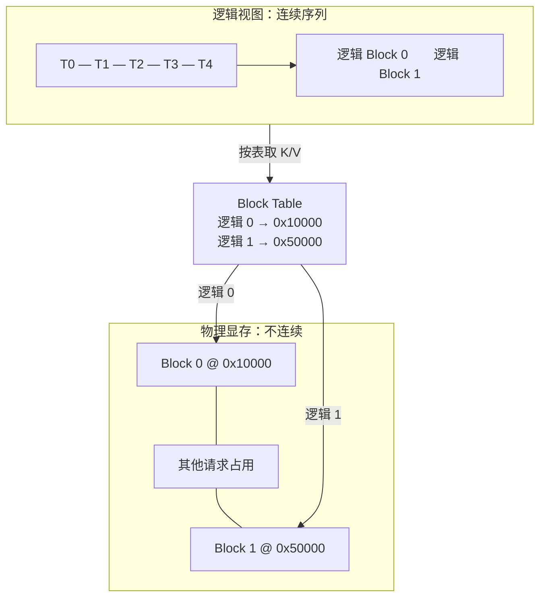

三套机制：前两套对上 KV 三个瓶颈，第三套撑起 Continuous Batching。

1. **按需分配（On-demand Allocation）**
   - 传统：启动就按 `max_seq_len` 预留整段（如 2048 × 0.5MB ≈ 1GB），实际只用 100 token 也占满。
   - PagedAttention：一块常见 16 token，**用满一块才申请下一块**。100 token 只要 `ceil(100/16) = 7` 块。
   - 注意算的是块容量：7 × 16 = 112 个坑，最后一块会有一点内部碎片，但比整段预留小一个数量级。
   - 对上瓶颈 1、2：短请求不再按最大长度占坑。

2. **写时复制（Copy-on-Write）**
   - 解决 Beam Search / Parallel Sampling 分叉时整份拷贝。
   - **Prompt 阶段**：几条采样共享同一份物理块，Block Table 指向同一批地址，**引用计数**记有几个人在用。
   - **生成阶段**：前缀继续共享；谁先写出不同 token，只给那条分配**私有新块**，共享块不改、不拷。
   - 如 3 路并行采样：共享 6 块 + 各 1 块私有 = 8 块；传统整份复制是 3 × 6 = 18 块。
   - 对上瓶颈 3：分叉只加页，不整段复制。引用计数掉到 0 再回收物理块。

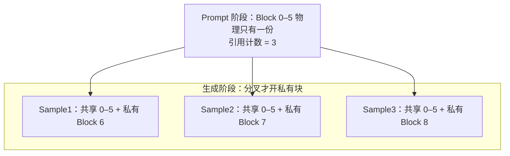

3. **动态重排（Continuous Batching 的关键）**
   - 调度按 token 插队：有人结束立刻让位，新请求马上进同一批 forward。
   - 传统 KV 要一块**连续**大显存，空位是碎的就进不去。PagedAttention 只收**分散的空闲块**，拼进新请求的 Block Table。
   - 像停车场：不必找一排连着的车位，有空位就能停。
   - 核心问题是「PagedAttention 如何支撑 Continuous Batching」，不必单开「什么是动态重排」。

## 什么是 Beam Search（束搜索）？

解码策略。贪心每步只留当前概率最高的那一个 token，走错一步后面全歪。束搜索每步同时留 **k 条**（beam width）最有希望的路径，全部走完再挑总分最高的一条。

翻译 "I love you"、k = 3 可以这样走：

1. **第一步** — 第一个词留 3 个候选：A「我」、B「吾」、C「俺」。
2. **第二步** — 每条各自往下扩（我→我爱 / 我喜欢，吾→吾爱…），再按**整条路径的累计分**只留前 3 名。
3. **结束** — 生成完或遇到结束符，在还活着的 k 条里选最好的。

k 越大越不容易漏掉好句子，算力和 KV 也按约 k 倍涨。聊天默认多是贪心或采样；翻译、受控生成才常开束搜索。

和 KV 的关系：几条 beam 的 **prompt 前缀相同**（如 "I love" 对应的 K/V）。传统实现却把整份 KV **拷 k 份**，每出一个 token 再拷一次，就是前面的 Copy-on-Decoding。PagedAttention 用写时复制：前缀块共享，分叉只开私有新块。

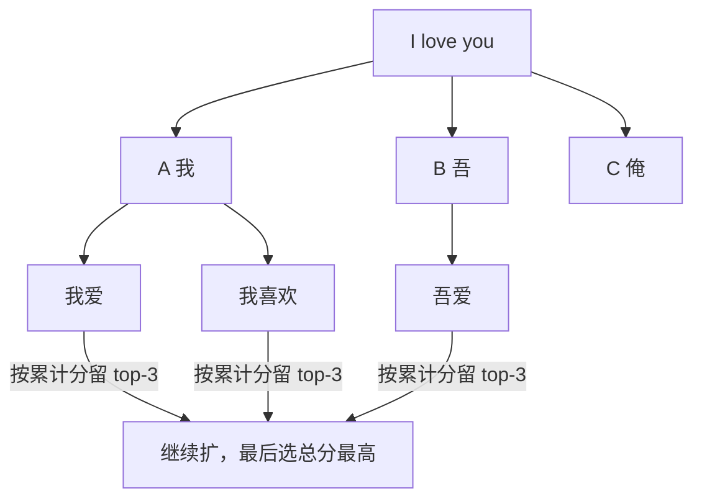

## 什么是 Parallel Sampling（并行采样）？

对**同一个 prompt** 同时跑多路**随机采样**，一次给出几条不同回复，让用户或后处理挑最好的。每路用不同随机数（或不同 temperature），互不按分数剪枝。

用户问「写一首关于春天的诗」，同时出 3 个版本：

1. 春风拂面柳丝长…
2. 三月桃花开满枝…
3. 细雨润物无声处…

和束搜索的差别：束搜索每步按累计分**只留 k 条**，最后交一条最优；并行采样是 n 条**独立采样**，n 条都交给上游。聊天里「再给我几个说法」、Best-of-N，多是这个。

和 KV 的关系两边一样：多条路径 / 多个回复共享同一段 Prompt，K/V 完全相同。传统做法整份复制 n 份；PagedAttention 写时复制，共享前缀只存一份，**写出不同 token 才开新块**。

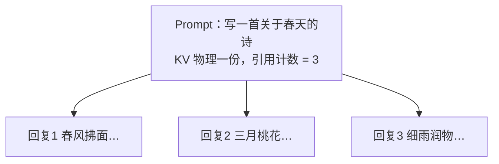

## [重点] PagedAttention 如何支撑 Continuous Batching？

Continuous Batching 按 token 插队之后，KV 必须跟着**随时伸缩、随时插入**。传统实现卡在外部碎片：总空闲够，但凑不出连续大块，新请求只能排队。PagedAttention 的动态重排：新请求到来**不用找连续大块**，把散落的空闲 Block 收进它的 Block Table。逻辑上仍是连续序列，物理上哪里空用哪里。像停车场：不必找一排连着的车位，有空位就能停。

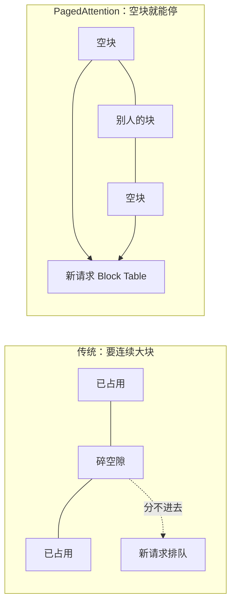

## Batch 是什么？

把多条用户请求打成一包，送进 GPU **做一次前向**。GPU 擅长并行：算 1 条和同时算 8 条，耗时往往差不多（计算单元够用时），吞吐却能翻几倍。像公交车：载 1 人和载 30 人，这一趟油耗差不多，运力完全不同。

三个人同时来：A 问「你好」要 100 token，B 问长题要 200，C 问写算法要 150。放进同一个 batch，GPU **每一步同时给 3 条各生成 1 个 token**。问题是长度不一：短的完了，长的还在跑，空出来的坑怎么办？

1. **静态 Batch（齐步走）** — 必须等这批里最长的跑完，才能接下一批。上面例子要等 200 步；A 100 步就结束，对应坑空等 100 步，卡白烧。
2. **Continuous Batching（按 token 插队）** — 谁结束谁让位，队列里的新请求立刻填进来。A 完了上 D，C 完了上 E，卡上尽量一直满。

生产吞吐靠的是 2，不是把静态 batch 开得很大。没有分页，新请求还是可能因为「凑不出连续 KV」而填不进去，见下一问。

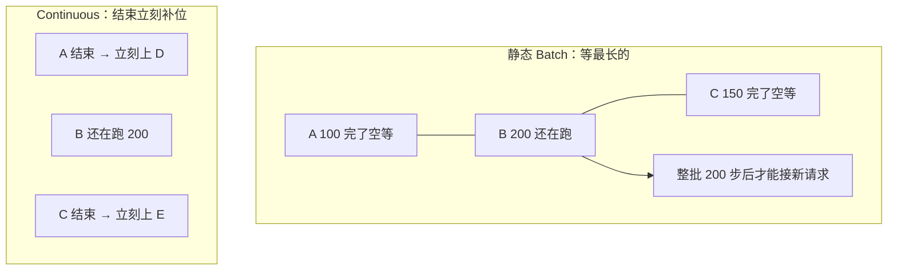

## vLLM 的 Iteration-level Scheduling 是什么？

Continuous Batching 在调度器上的落地：每生成 **1 个 token**（一次 iteration）就调度一次，而不是等整批请求都结束。传统是 **Request-level**——这一桌全吃完才翻台；vLLM 是哪桌吃完立刻安排新客人。

每个 iteration 三步：

1. **收新请求（Prefill）** — 取出刚到的请求，按 `ceil(prompt 长度 / block 大小)` 向 PagedAttention 要块，加入当前 batch。
2. **做一次前向** — 这个 batch 里每条请求各往前走一步（新请求出首个 token，老请求再出 1 个）。
3. **清结束的** — 谁吐出结束符，就从 batch 拿掉，**立刻归还 Block**。同一轮里腾出的页，下一步就能给新人。

所以叫 Iteration-level：调度粒度细到「一步」，空位本步就能补上。没有分页，第 3 步释放的是碎洞，新人仍可能进不来；有 Block Table，散页也能拼。

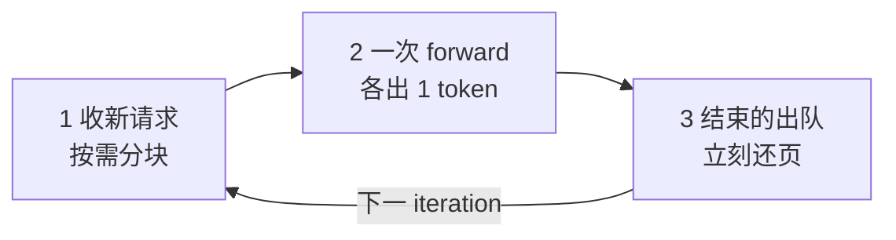

## [重点] 什么是推测解码（Speculative Decoding）？

又叫投机采样。来自 2023 年论文 _Fast Inference from Transformers via Speculative Decoding_。Decode 一步通常只出 1 个 token，大模型前向很贵却吃不满算力。思路：让小模型先**猜**一串，大模型一次前向**并行校验**，对上的整段收下。

两个角色：

1. **Target（目标模型）** — 要加速的大模型，如 70B，最终以它的分布为准。
2. **Draft（草稿 / 近似模型）** — 便宜的小模型，如 7B，负责连猜 k 个 token。

不是「字一样就收」。Draft 每个字有概率 p，Target 给同一个位置打分 q，用 `min(1, q/p)` 决定收不收，所以最终仍像 Target 自己在采样。

**例子 1（怎么收、怎么拒）。** 已有前缀「北京是」，K = 3。

1. **Draft 先猜** — 7B 自回归写出：首（p=0.70）、都（p=0.60）、。（p=0.40）。三个字各记一个 p。
2. **Target 一次打分** — 70B **一次前向**同时给这三个位置打分：首 q=0.75、都 q=0.55、。 q=0.10。耗时接近只算 1 个 token，因为是并行。
3. **从左到右掷骰子** — 各抽一个 0～1 的随机数，比如 0.20、0.40、0.80。随机数 ≤ `min(1, q/p)` 就收下。
   - 「首」：0.75/0.70 > 1，门槛 = 1，0.20 ≤ 1 → **收**
   - 「都」：0.55/0.60 ≈ 0.92，0.40 ≤ 0.92 → **收**
   - 「。」：0.10/0.40 = 0.25，0.80 > 0.25 → **拒**（后面就算 Draft 还猜了也不看）
4. **处理拒绝** — 前缀已是「北京是首都」。在「。」这个位置，按论文从 `max(q − p, 0)` 的修正分布里再采 1 个，比如采到「的」。拼上：**北京是首都的**。若 3 个全收，Target 还能白送第 4 个字（同一次前向里多出来的 logits）。
5. **这一轮结果** — Target 只跑了 **1 次**，落下 3 个字（2 个草稿 + 1 个修正）。普通 Decode 要跑 3 次才有 3 个字。

猜得准（q 不比 p 小太多）就连收；Draft 乱猜、q 很低，第一两个就被拒，加速没了。同系列、同 tokenizer 接受率更高。按这套收/拒，**统计上仍是 Target 的分布**，不是小模型在替答。

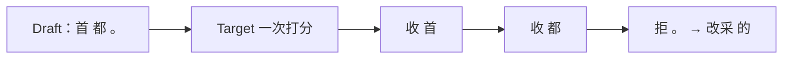

**例子 2（和传统 Decode 比次数）。** 要从「我」往后写。

传统自回归，大模型一步一个字，调 4 次：我→爱，我爱→中，我爱中→国，我爱中国→EOS。

推测解码：小模型先一口气猜出「爱中国 EOS」4 个；大模型 **一次**把这 4 个都验了。真相若是「我爱中华」：爱命中、中命中、国没命中（应是华）。这一轮大模型只调 **1 次**，确认 2 个 + 修正 1 个 →「我爱中华」。后面的 EOS 草稿直接丢掉。

只要平均每次能收下的草稿个数大于 0，大模型调用次数就比「一步一字」少，就有加速。被拒的字从修正分布里重采，**质量仍是大模型的**，不是小模型在替答。

## Medusa 推理框架是什么？

推测解码的一种落地：不另训一个 Draft 小模型，而是在原模型最后一层隐状态上再挂几个**轻量解码头**。原头预测「下一个字」，第 1 个头预测「下下个」，第 2 个头预测「再下一个」——一次前向同时猜出后面好几步。名字来自美杜莎：一根身体、很多头。

和前面 7B+70B 那套的差别：Draft 不再是另一份权重、另一次自回归，而是几个小 MLP 头，几乎不增加显存。猜完之后把各头 top-k 拼成一棵**候选树**（不是只猜一条），用 **Tree Attention** 一次前向把整棵树都验掉，收下最长合法前缀。

还是「我」往后写：原头出「爱」，头1 出「中 / 华」，头2 出「国 / 华」。树里可能有「爱中国」「爱中华」几条；一次校验发现真相应是「我爱中华」，这一步收下 3 个字，而不是只出「爱」。

1. **Medusa-1** — 骨干冻住，只训这些头。质量对齐原模型，论文大约 **2.2×** 加速。
2. **Medusa-2** — 头和骨干一起训，头更准、更快（约 **2.3–2.8×**），但要小心把原模型能力训坏。
3. **无数据** — 可用自蒸馏：让原模型自己生成，再拿来训头。

头猜得越准，一次收下的步数越多。头太浅、候选树太小，就退化成普通 Decode。一句话：Medusa = 推测解码 − 独立 Draft + 多头猜未来 + 树形一次校验。

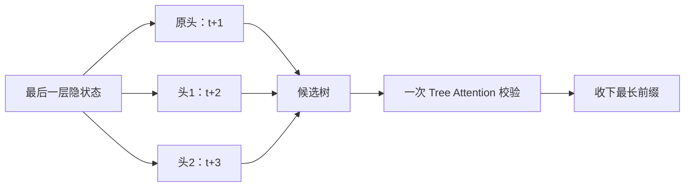

## 什么是 Medusa Heads？

挂在 decoder 最后一层隐状态后面的 **k 个 LM Head**（投影层）。原模型本来只有 1 个头发「下一个字」；变成 k 个头，一次就能猜后面 **k 个位置**。常见是再加 3 个额外头，加上原头，并行给出后 4 个 token 的候选。

训练只动这些头：骨干 **frozen**，算量小。论文量级是单卡 A100-80G 一天能训完，不要当成自己的实验数字。

只拿每个头的 **Top-1** 去校验，就退化成 Blockwise Parallel Decoding：一条直线往后猜。Vicuna 上「下下个字」Top-1 大约只有 60%，接不住，所以才要每个头出 Top-k，交给 Tree Attention 组树。

Heads 负责**并行猜未来**；别把它们理解成又一个独立小模型。

## 什么是 Tree Attention？

Medusa 把多头的 Top-k 拼成一棵**候选树**，一次前向把整棵树验完。原 LM Head 的输出当根，往下每一层对应一个 Medusa Head；从根走到叶是一条候选路径（论文叫 candidates path）。基础版每个头 greedy 只取 Top-1，树退化成一条链。

例子：头1 出 2 个候选，头2 出 3 个。头1 的任意一个都可以和头2 的任意一个配对，节点数 = `2 + 2×3 = 8`。Attention Mask 也是 **8×8**：每个 token **只看自己的祖先**，不看兄弟枝。这样才能在同一 batch 里并行验多条路径，又不会让「爱中国」去看「华」那条的 KV。

验完从根往下走，收下最长对得上的前缀，分歧处停。树越大一次能中的越多，mask 和算力也越大，要折中。

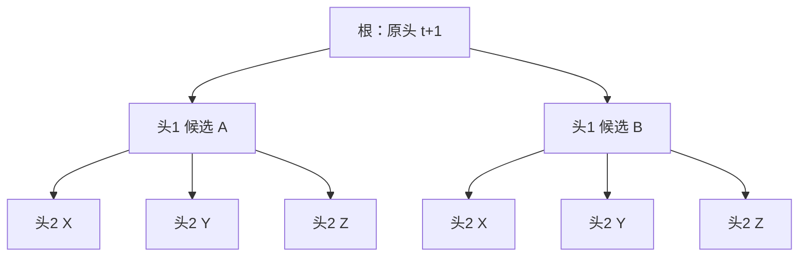

## 贪心、束搜索、采样有什么区别？

每一步模型只给出「下一个词」的概率分布，**怎么从这个分布里挑字**，就是解码。三种常见做法，经典例子是续写 "The"：

- dog 0.4 → has 0.9 / and 0.05 / runs 0.05
- nice 0.5 → woman 0.4 / house 0.3 / guy 0.3
- car 0.1 → drives 0.5 / is 0.3 / turns 0.2

1. **Greedy Search（贪心）** — 每步只取概率最高的那个。快。"The" 后 nice 0.5 最大，再接 woman 0.4，得到 **The nice woman**。问题：走错一步后面全没了；**低概率词后面可能藏着更高分的整句**（dog 0.4 后面 has 0.9，联合 0.36 > nice×woman=0.20），贪心看不见。也容易反复重复同一短语。聊天默认有时用这个，或 temperature=0。

2. **Beam Search（束搜索）** — 每步留 k 条最有希望的路径，最后按**整句累计分**挑。k=2 时能保住 dog 这条，最终更可能出 **The dog has**，比贪心那句联合概率更高。仍不保证全局最优（没搜完全部树）。翻译、摘要常用；开放闲聊容易呆板、重复。KV 会按约 k 倍涨，见前面束搜索。

3. **Sampling（采样）** — 按条件概率**随机**抽下一个词，输出不再确定，小概率词也有机会。上面也可能抽到 car（0.1）再接到 drives。
   - **Top-K**：先截概率最大的 K 个，重新归一化再抽，挡住长尾垃圾。
   - **Top-p（核采样）**：不固定 K，从高到低累加，直到概率和 ≥ p，在这个最小集合里抽。
   - 两者可一起用。开放生成通常比贪心、束搜索更自然。聊天默认多是采样（再加 temperature）。

对照：贪心看眼前最高；束搜索看 k 条整句分；采样故意留随机，Top-K / Top-p 只是把随机限制在靠谱词里。

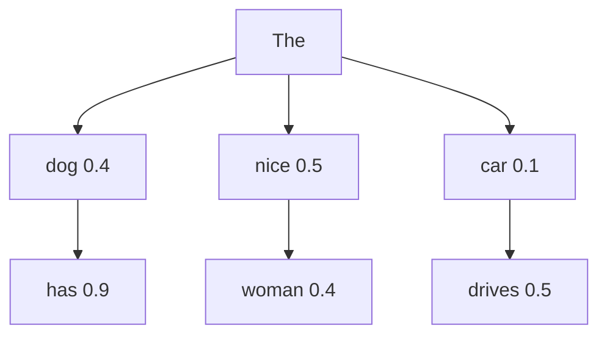

贪心走红线 **nice → woman**；束搜索能改走 **dog → has**（联合更高）；采样三条都可能，包括 **car → drives**。

## 什么是 Typical Acceptance（典型接受）？

Medusa 树上有很多条候选路径，哪些收、哪些拒。最简单是沿用推测解码：逐个比 p、q，和原模型分布**完全对齐**才收（拒绝采样）。温度一开，分布对不齐，草稿再像也会被拒，加速掉下来。Typical Acceptance 放宽成：只要这个词在原模型看来**够合理**，就收——允许一点偏差，换接受率和速度。

判断标准不是「概率最高才收」，而是既不太无聊、也不太离谱。借鉴 Typical Decoding：

| 类型            | 含义                     | 例子                       |
| --------------- | ------------------------ | -------------------------- |
| 太 predictable  | 条件概率过高，信息量太低 | Donald → Trump（几乎必然） |
| 太 surprising   | 条件概率极低，不合常理   | 今天星期 → 八              |
| Typical（合理） | 概率适中，自然且有信息   | Donald → announced         |

具体靠 **熵 H** 和阈值。H 是原模型在当前位置整份分布的不确定度；候选 token 的信息量是 `-log(p)`。`-log(p)` 和 H 接近，说明刚好符合此刻该有的意外程度，就当「典型」收下。太低=太可预测，太高=太意外，都滤掉。温度调门槛：温度高，更多候选过关，更快，质量可能掉。

和推测解码那套 `min(1, q/p)` 的差别：那边追求**分布严格一致**；这边追求**像人话、别离谱**，所以聊天开温度时接受率更稳。Medusa-1 冻骨干时质量仍跟原模型走；Typical Acceptance 是在验树这一步换了更松的闸门。

## EAGLE 推理框架是什么？

在 Medusa 之后的推测解码。传统草稿有三个痛点，EAGLE 对着改：

1. **独立 Draft** — 还要维护 LLaMA-7B 给 70B 当草稿，两套权重、两套部署。
2. **Token 级预测难** — 离散词不确定度高：「I」后面可能是 am / always / like，猜错一步整段废。Medusa 各头还互不看对方出了什么。
3. **树是静态的** — 简单算术和复杂推理用同一棵草稿树，简单题浪费、难题又不够深。

EAGLE 的草稿不再另起一个完整小模型，而是一个很浅的模块（常见 **1 层 Transformer**），在**特征（隐状态）**上自回归：先猜「下一个隐状态」，再套原模型的 LM Head 出词。特征是连续高维的，比直接猜 token 稳。为了对付采样不确定性，草稿还会把**已经采出来的那个词**喂回去：用 `(f_I, t_am)` 去猜 am 之后的特征，而不是只拿 `f_I` 同时猜 am 和 always。

验还是 Target 一次前向，分布仍以大模型为准。EAGLE-2 再按置信度**动态长树**：简单题树浅、难题树深，对上痛点 3。

和 Medusa 对照：Medusa 是多个互不依赖的头、一次猜后 k 步；EAGLE 是浅层草稿顺着特征往下走，并带上已采样的词。头更准、部署仍是「一个底座 + 一个小插件」，不是两套模型。

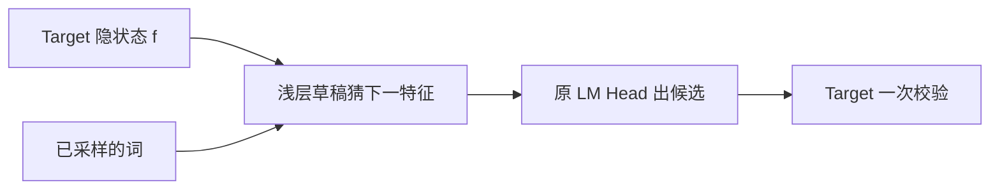

## 推测解码、Medusa、EAGLE 有什么区别？

三种都是「先猜后验」，差在草稿**怎么猜、猜什么**。

1. **Speculative Decoding** — 独立 Draft 小模型，**token → token**。7B 给 70B 当草稿，要维护两套模型。
2. **Medusa** — 多头并行，**feature → token**，每个 Head 独立用当前特征猜未来某步，Head 之间**无交互**。
3. **EAGLE** — 特征级自回归，**feature + token → feature → token**。用特征序列和已采样的词猜下一个特征，再从特征出 token。

一句话：经典推测是两套模型互猜字；Medusa 是多个哑巴头同时猜；EAGLE 是浅层草稿顺着隐状态走，还把已经采到的词喂回去。

## EAGLE 的贡献和优势分别是什么？

别混成一锅「优点」。**贡献**是方法新在哪；**优势**是落地为什么用。全称 Extrapolation Algorithm for Greater Language-model Efficiency：在特征层（常用倒数第二层）做自回归，并把下一时刻已采样的 token 喂进草稿，用来消掉「下一个特征该对应 am 还是 always」的不确定。

**贡献（新在哪）**

1. **特征级自回归更简单** — 草稿不在词表上赌下一个 ID，而在倒数第二层隐状态上预测下一拍。特征连续、语义上相邻的点靠得近，比离散 token 更好学。
2. **特征不确定性** — 只看当前特征会分不清后面该跟哪个词；把下一时刻的 token 也作为输入，特征预测才有唯一目标。

**优势（为什么用）**

1. **加速且分布不变** — 不微调原 LLM，理论上输出仍是 Target 的。论文在 LLaMA2-Chat 70B 上对话 / 代码 / 数学大约 **2.7–3.5×**，当论文数字，
2. **训得便宜** — 70B 量级、不到 7 万条对话、一两天能训完（同样是论文口径）。
3. **通用** — 套在任意自回归 LLM 上，原模型冻住。
4. **可叠加** — 能量化、编译一起用，继续抠成本。

## 为什么特征比 Token 更好预测？

EAGLE 的第一项贡献：让草稿在**特征（隐状态）**上自回归，而不是直接猜下一个 token。因为特征连续、好学，离散词表不好学。

续写 "The capital of France is"：

1. **Token 层** — 下一个可能是 Paris / located / a…。Paris 只是词表里一个离散 ID，和 France **没有数学上的近邻关系**。候选跳来跳去，不确定度高，草稿容易猜飞。
2. **特征层（常用倒数第二层隐状态）** — Paris 的向量和 France、capital 在语义空间里本来就近。特征随时间走得平滑、连续，下一拍往哪飘更好学。

所以浅层草稿跟特征，再套原模型 LM Head 出字，而不是在词表上赌 ID。这和「把已采样的词喂回去消分叉」是另一件事：那边解决的是 am / always 采到哪个之后特征该往哪走。

## EAGLE Draft Model 由哪几部分组成？

三个模块：**嵌入层、LM Head、自回归头**。嵌入和 LM Head **复用目标 LLM 的参数，不另训**；真正要训的只有自回归头。

输入是两路：已有的**特征序列**，以及**提前一个时间步**的 token 序列（已经采出来的那个词）。token 先变成嵌入，和特征拼成融合序列。

自回归头 = 一层 FC + 一层 decoder。FC 把融合向量降到隐空间，decoder 预测**下一个特征**；再拿冻住的 LM Head 从该特征算出词分布、采出下一个 token。预测到的特征和这个 token 拼回输入，继续往下猜。

草稿阶段用 Tree Attention 长一棵树：做 m 次前向，深度为 m，节点数可以多于 m。论文图里 3 次前向就能长出约 10 个 token 的树，不是一步只出一个字。

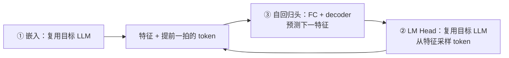

## EAGLE Draft Model 怎么训练？

只训自回归头。两件事一起学：特征要像，字也要对。

1. **回归** — 预测下一个特征，用 Smooth L1（类似 Huber），输出特征和目标 LLM 的真特征比。
2. **分类** — 特征只是中间量，最终要的是 token。真特征、预测特征各自过同一个冻住的 LM Head，两组分布做交叉熵。
3. **合起来** — `L = L_reg + w_cls · L_cls`。分类损失通常比回归大一个数量级，论文把 `w_cls` 设成 **0.1**，免得分类把回归冲掉。

理想数据是目标 LLM 自己生成的文本，贵。EAGLE 对数据不敏感，用固定语料就能训。草稿阶段特征误差会累积，训练时给目标特征加均匀噪声（论文用 `U(-0.1, 0.1)`），让头对不准的特征也能往下走。

## EAGLE 验证阶段做什么？

草稿长完树之后，要用**目标 LLM** 验收，保证字还是大模型会写的那些，分布不变。

1. **Tree Attention 一次前向** — 树上多个候选一起打分，不必一条路径验一次。
2. **按推测采样收/拒** — 每个节点看目标分布 vs 草稿分布。目标概率 / 草稿概率 大于抽到的随机数就收下；拒了就把目标分布减去草稿那部分（截成非负）再采或换枝。
3. **记下收下的 token 和特征** — 下一轮草稿从这里接着长，前后才能接上。

验的是分布对齐，不是 Typical Acceptance 那种「够合理就行」。通过这一步，输出统计上仍等价于直接跑目标 LLM。

## EAGLE-2 相对 EAGLE-1 改了什么？

EAGLE-1 草稿树形状固定。EAGLE-2 改成**上下文感知的动态草稿树**：草稿模型的置信度能较准地近似「这个 token 验的时候会不会被收下」，按置信度决定树往哪长。不另训模型、也不动原 LLM。论文加速大约 3.05–4.26×，比 EAGLE-1 快约 20%–40%，当论文数字。

三点贡献：

1. **动态草稿树** — 按预期接受率改树形，不再用同一套静态树。
2. **分布仍对齐原模型** — 验收还是推测采样，无损加速。
3. **不必再训一份** — 沿用已有 EAGLE 草稿和冻住的 LLM，没有第三套权重。

## 静态草稿树和动态草稿树有什么区别？

静态树（EAGLE-1）：不管题目难不难，树的形状事先定好，每个位置都要长出固定几根枝。动态树（EAGLE-2）：看当前上下文和草稿置信度，高的往下扩，低的剪掉。

问 `10+2=`：

- **静态** — 主枝 `1(0.95) → 2(0.9)` 是对的，却还要长 `3(0.05) → 0(0.04)`，白算。
- **动态** — 主枝继续接到 `. (0.85)`；`3` 置信度低，直接剪。算力堆在高概率分支上。

简单算术不该和长推理用同一棵树：静态要么浅了不够用，要么深了浪费。

## 动态草稿树怎么生成？

草稿树用来暂存推测时的候选 token。静态树所有上下文共用一个形状；动态树每步按「这个词大概能不能被目标模型收下」改结构。EAGLE-2 分两段：

1. **扩展（Expansion）** — 在当前层里挑最有潜力的节点，用草稿模型长下一层。潜力看节点的**值**：自己的置信度，还要乘上祖先的置信度（整条路都得像能过验）。
2. **重排（Reranking）** — 刚扩出来的点在局部深，全局未必最优。把树上所有草稿 token 按值重新排序，只留值最高的前 m 个，并保证它们仍连成一棵树，不能留一堆断枝。

先往深处探，再按全局值收回来，树才会又深又省。

## 扩展阶段怎么选要展开的节点？

Tree Attention 理论上能把当前层所有 token 一次送进草稿，一次前向算出各自的下一个词。层一厚，token 数指数涨，草稿会被拖死，所以必须**有选择地扩**。

推测采样里，前面一个词被拒，后面整枝作废。一个 token 只有**从根到它的前缀全收下**才算真收下。所以不看单点置信度，看**全局接受率** \(V_i\)：根到 \(t_i\) 这条路上每个点接受率的乘积。接受率事先不知道，用草稿置信度 \(c_j\) 近似（二者强正相关）：

\[
V*i = \prod*{t*j \in \mathrm{Path}(\mathrm{root}, t_i)} p_j \approx \prod*{t_j \in \mathrm{Path}(\mathrm{root}, t_i)} c_j
\]

每一层只拿 \(V\) 最高的前 k 个节点送进草稿，用输出去长下一层。\(V\) 高的枝更可能整条过验，算力堆在这。

## 为什么扩展完还要重排？

扩展只负责把树**加深**。接受率在 0～1 之间，乘得越深 \(V\) 越小，所以刚长出来的深层点，值往往不如**没扩的浅层点**。扩展挑中的 token 不能直接拿去验。

重排：把树上所有草稿 token 按 \(V\) 再排一次，只留最高的前 m 个。子节点的 \(V\) 一定 ≤ 父节点（乘上了一个 ≤1 的数）；\(V\) 相同优先留浅的。这样前 m 个一定还连成一棵树，不会出现「有儿子没爹」。

留下的点展成一维序列，送给原 LLM 做验证。掩码不能再用普通下三角：不同枝的兄弟看不见彼此，每个 token **只看自己的祖先**，和自回归「只看左边」对齐。重排保证送去验的是全局 \(V\) 最高的那批，平均接受长度才会上去。

## EAGLE-1 和 EAGLE-2 还有什么瓶颈？

数据堆上去，加速比几乎不涨。ShareGPT 从约 6.8 万扩到 8 倍，EAGLE-1/2 仍趋于饱和。两个根因：

1. **特征预测被卡死** — 草稿必须去拟合目标模型的顶层特征，表达空间被钉在那一层上，再多样本也学不出更强的草稿。
2. **训练和推理不一致** — 训练时输入是目标模型的真特征 \(f_1, f_2,\ldots\)（标准答案）；推理时输入混进了草稿自己生成的特征，带误差。步数一长，误差累积，后面越猜越歪。

表现：第 1 步接受率大约 0.8，到第 5 步掉到约 0.6。数字是论文量级。动态树解决的是「树往哪长」，不解决「草稿越走越不准」。

## EAGLE-3 的 Training-time Test 是什么？

针对「训练只见标准答案、推理要吃自己的错」：训练时就模拟推理的多步生成，让草稿适应**自己的输出**。叫 Training-time Test（训练时测试）。

传统 EAGLE 一次只训一步：输入真特征 \(f_1, f_2\)，去拟合 \(f_3\)。像看着答案做练习题，上考场遇到自己写错的中间步就不会了。

EAGLE-3 多步串起来：

1. 先用真特征 \(f_1, f_2\) 让草稿出 \(a_1\)。
2. 下一步输入变成 \(f_1, f_2\) **加上** \(a_1\)（真假混合），再出 \(a_2\)——故意把误差喂回去。
3. 再把 \(a_2\) 拼进去继续。训练时就已经在闭卷 + 自我修正。

这样推理时误差不再一步步炸。论文里各步接受率能稳住在约 0.8，而不是第 5 步掉到 0.6。原 LLM 仍然冻住；改的是草稿怎么练，不是再挂一个新模型。

## EAGLE-1、EAGLE-2、EAGLE-3 有什么区别？

三代都是特征级推测解码，一代只打一个痛点。加速比是论文量级。

| 版本    | 核心突破                                                 | 解决什么                                                                     | 论文加速 |
| ------- | -------------------------------------------------------- | ---------------------------------------------------------------------------- | -------- |
| EAGLE-1 | 特征级预测 + Shifted-Token（把已采样的词提前一拍喂进去） | Token 层不确定度高，直接猜字容易飞                                           | ~3.0×    |
| EAGLE-2 | 上下文感知的动态草稿树                                   | 静态树不管简单题难题都同一形状，浪费算力                                     | ~4.2×    |
| EAGLE-3 | Training-time Test + **多层特征融合**                    | 草稿被钉死在顶层特征上，数据再多也不 scaling；训练见标准答案、推理吃自己的错 | ~6.5×    |

大 Batch 才是生产常态。SGLang、Batch=64 时卡已经偏 Compute-Bound，推测解码那套「少搬权重」的红利变小：

1. **EAGLE-1/2** — 吞吐大约 0.99×，几乎没加速。
2. **EAGLE-3** — 还能大约 1.38×。多层特征 + 训练时测试让草稿在高并发下仍够准，这才是线上价值。

## 推测解码在 vLLM 中如何集成？

算法是「先猜后验」，调度是 Continuous Batching「按 token 插队」。两套逻辑直接叠会打架，vLLM 里主要三个冲突点。

1. **草稿想 batch=1，调度要动态 batch**
   - 草稿阶段是小模型自回归连猜 k 个，经典写法一条请求自己跑，batch 钉死成 1。
   - Continuous Batching 要把许多请求打进同一个**不断变大变小的 batch**。
   - 拆开：草稿当独立 **micro-batch**（各请求自己猜，不跟主 batch 齐步）；猜完的候选并进主 batch，Target **一次前向**一起验。猜和验的并行粒度不同，不要挤在同一次 iteration 里硬凑。

2. **Medusa Tree Attention 要特殊 Mask**
   - 树上每个 token **只看自己的祖先**，不是普通下三角，兄弟枝不能互看。
   - vLLM 走 **Custom Attention Backend**：调度、PagedAttention 不动，只换注意力核和 mask。Tree Attention、普通 Decode 可以共一套引擎。

3. **显存碎片（草稿模型 + KV Cache）**
   - 独立 Draft 自己有权重和 KV，Target 又一份。两套都按最大长度连续预留，碎片和前面 KV 三个坑一样，还更挤。
   - **PagedAttention 统一管**草稿和目标的 KV：都切成 Block，按需分配，前缀能共享。草稿被拒的枝把页还回去即可，不必整段拷贝或预留。

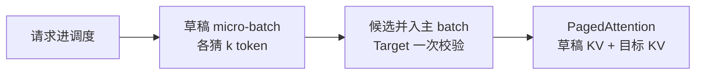

一句话：vLLM 不是把推测解码塞进原有一步一 token 的循环，而是 **猜和验拆调度、树用自定义注意力、KV 仍走分页**。

## EAGLE 在 vLLM 中的工作流程

上面三个冲突落地之后，**一次 Iteration** 不再是「batch 里每人出 1 个 token」，而是四步：选谁推测 → 草稿长树 → Target 验树 → 按接受结果改 Block Table。

1. **选候选请求** — 不是当前 batch 全开推测。优先长度最长、或历史上接受率高的。长序列 Decode 更偏 Memory-Bound，推测更划算；接受率低的请求草稿白算，不如普通一步一 token。
2. **草稿阶段（Draft）** — 用极浅的 EAGLE draft（量级约 **0.24B**）做树状采样，常见 **3–5 步**，长出候选 token 树。输入是 Target 的特征 + 已采样的词，不是另起一个 7B。
3. **验证阶段（Verify）** — Target 用 Tree Attention **一次前向**并行验树上所有 draft token，按推测采样收/拒，得到接受长度。
4. **更新 Block Table** — 收下的 token 对应 Block 留下；被拒的枝把页还回 PagedAttention。下一次 Iteration 从接受前缀接着走，不必拷整段 KV。

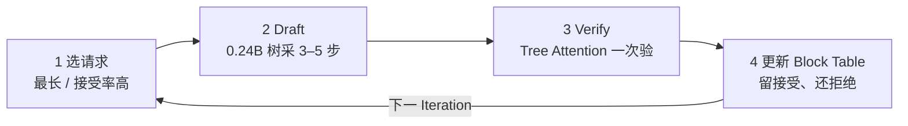

和普通 Iteration-level 的差别：原来第 2 步是「各出 1 token」；EAGLE 把这一步拆成草稿 micro-batch + 主 batch 校验，第 4 步用分页消化树的分叉和回滚。

## vLLM + EAGLE 的 Iteration 流程

同一件事的调度伪代码。一次循环仍是 Iteration-level，只是 forward 换成「先 EAGLE 长树，再 Target 验树」。

```text
# 1. 选择适合推测的请求
draft_requests = select_for_speculation(current_batch)

# 2. 草稿阶段：轻量 EAGLE 快速预测（通常 3–5 步）
for step in range(max_draft_tokens):
    draft_features = eagle_model.forward(target_features, previous_tokens)
    draft_tokens = sample(draft_features)   # 树状采样

# 3. 验证阶段：目标模型并行验证所有候选
verified_tokens, accepted_length = tree_verify(draft_tokens, target_model_logits)

# 4. 更新 PagedAttention Block Table
update_block_table(request, accepted_length)
```

对应关系：

| 代码                           | 上节步骤 | 卡住什么                     |
| ------------------------------ | -------- | ---------------------------- |
| `select_for_speculation`       | 选请求   | 大 Batch 时不是人人都推测    |
| `eagle_model.forward` + 树采样 | Draft    | 草稿 micro-batch，参数极小   |
| `tree_verify`                  | Verify   | 自定义 Attention + 特殊 mask |
| `update_block_table`           | 更新页表 | 接受留页、拒绝还页，防碎片   |

vLLM 的循环还是「一步一调度」；EAGLE 只替换了这一步里面的生成，用 **选请求 → 浅层长树 → 一次验树 → 按接受长度改页表** 换掉「每人吐 1 个字」。

## [重点] 关键性能指标（KPIs）

线上别只报「tokens/s」。延迟、吞吐、推测解码要分开看，否则会用吞吐掩盖尾延迟，或把草稿开销当成加速。

**延迟类**

| 指标                           | 含义                         | 主要卡在哪                                |
| ------------------------------ | ---------------------------- | ----------------------------------------- |
| **TTFT** Time To First Token   | 请求发到第一个 token 出来    | **Prefill**：prompt 越长越慢              |
| **TPOT** Time Per Output Token | 相邻输出 token 的间隔        | **Decode**，受 batch size 影响            |
| **TTFB** Time To First Byte    | 首字节网络返回（含队列等待） | 排队 + 网关 + Prefill，比 TTFT 多一层等待 |

聊天体感：TTFT 决定「是不是卡住了」，TPOT 决定「字是不是一个一个往外蹦」。Batch 开大，吞吐上去，TPOT 往往变差。

**吞吐类**

1. **Throughput** — 总生成 token / 总时间，tokens/s。看卡填得满不满，不看单用户体感。
2. **Goodput** — **满足延迟约束**的请求数/秒，例如 TTFT < 1s 且 TPOT < 100ms。吞吐很高但全超时，Goodput 接近 0。
3. **GPU 利用率** — 看的是 **Compute Utilization**（算力是否吃满），不是显存占用。显存 90%、算力 20% 就是 Decode Memory-Bound。

**推测解码指标**

接受率像猜题命中率：草稿猜了 5 个，Target 收下 3 个，**α = 3/5 = 0.6**。α 越高，一次校验落下的字越多，加速越明显；α 太低等于白付草稿计算。

1. **接受率 α** — 被接受的 draft tokens / 总 draft tokens。**> 0.6 良好，< 0.4 要调**（换草稿、缩短 draft_len、别在大 batch 上硬开）。
2. **有效批量** — `Real BS × (1 + α × draft_len)`。同一物理 batch，推测让每步等价多吐了字，用来看**实际加速**，不是标称 batch。
3. **开销比** — Draft 耗时 / Target 耗时。草稿必须足够便宜：EAGLE 大约 **5–10%**，Medusa 大约 **8–12%**。开销比接近 1，再高的 α 也被吃掉。

α 和开销比对冲：猜得准但草稿太贵，或草稿极便宜但 α < 0.4，都加速不了。大 Batch 下 Target 已接近 Compute-Bound，开销比会恶化，这就是 EAGLE-1/2 在 Batch=64 掉到约 0.99× 的指标语言。

## 怎么用流式输出测 TTFT 和 TPOT？

非流式只能拿到整段结束时间，分不清「第一个字等多久」和「后面每个字隔多久」。`stream=True`，每个 token 落地打一个时间戳：

1. **TTFT** = 第一个 token 时刻 − 发请求时刻。看 Prefill。
2. **TPOT** = 相邻输出 token 的间隔。报平均、P50、P95，看 Decode 抖不抖。
3. **吞吐** = 生成 token 数 / 墙钟时间，只作对照，不替代延迟分布。

换短 / 中 / 长 prompt 各打一轮，TTFT 本应随 prompt 变长（Prefill 算力涨）。若短句反而最慢，先怀疑**冷启动**，不要据此调参。

测之前发几条预热请求：第一次会撞上 CUDA kernel 的 JIT、显存分配，TTFT 可以虚高好几倍。示例里「你好」第一次 355ms，后面中长 prompt 落到 40–63ms，不是短句比长句更难，是 GPU 还没热。生产同样要 warmup，避免第一个真实用户吃冷启动。

## vLLM核心优化参数

上线 vLLM 先按五块记：并行切开模型、显存决定能塞多少请求、量化换容量、推测解码换 Decode、调度决定谁先跑。数字是常用起点，不是标准答案。

**并行与分布式**

| 参数                       | 说明                                   | 怎么设                            |
| -------------------------- | -------------------------------------- | --------------------------------- |
| `--tensor-parallel-size`   | 张量并行（TP）：一层里的矩阵切到多张卡 | 按单机 GPU 数，常见 2 / 4 / 8     |
| `--pipeline-parallel-size` | 流水线并行（PP）：按层切到不同卡/节点  | 单机放不下、要跨节点时再开        |
| `--data-parallel-size`     | 数据并行（DP）：多份完整副本打不同请求 | 高并发、单副本已经吃满一张/一组卡 |

**内存与 KV Cache**

| 参数                       | 说明                                          | 怎么设                                               |
| -------------------------- | --------------------------------------------- | ---------------------------------------------------- |
| `--max-model-len`          | 最大序列长度（prompt + 生成）                 | 按真实业务，盲目 32k/128k 会把 KV 坑占满             |
| `--max-num-batched-tokens` | 一步里最多算多少 token（Prefill+Decode 合计） | 显存允许就加大，吞吐上去，TTFT 可能抖                |
| `--max-num-seqs`           | 同时在跑的最大序列数                          | 跟显存和平均长度一起调，太大 TPOT 变差               |
| `--kv-cache-dtype`         | KV 的存储精度                                 | **fp8** 省显存，质量损失通常 <1%                     |
| `--enable-chunked-prefill` | 长 prompt 切块和 Decode 穿插                  | **强烈建议开**：避免一条超长 Prefill 堵住整批 Decode |
| `--enable-prefix-caching`  | 公共前缀的 KV 复用                            | 多轮对话、同一 system prompt **必开**                |
| `--gpu-memory-utilization` | 给模型+KV 的显存上限                          | 常见 **0.90–0.95**，留一点给图捕获/碎片              |

这三项最容易一起炸：`max-model-len` × `max-num-seqs` 决定 KV 下限；`gpu-memory-utilization` 是总盘子；PagedAttention 只管怎么切块，盘子不够照样 OOM。

**量化与压缩**

| 参数             | 说明                                             |
| ---------------- | ------------------------------------------------ |
| `--quantization` | 权重量化：awq / gptq / fp8 / int8 等             |
| `--load-format`  | 加载格式：`auto`；`safetensors` 通常更快、更安全 |
| `--dtype`        | 计算精度：float16 / bfloat16 / float32           |

权重 `--quantization` 和 KV `--kv-cache-dtype` 不是一回事：前者瘦模型，后者瘦缓存。A100 常用 bf16 计算；KV 再单独 fp8 是常见组合。

**推测解码（EAGLE / Medusa）**

| 参数                                       | 说明                                            |
| ------------------------------------------ | ----------------------------------------------- |
| `--speculative-model`                      | 草稿模型路径（HuggingFace 格式）                |
| `--num-speculative-tokens`                 | 一次猜多少步，建议 **3–5**                      |
| `--speculative-draft-tensor-parallel-size` | 草稿的 TP，通常 **1**（草稿很小，切开还要通信） |
| `--speculative-max-model-len`              | 草稿侧最大长度                                  |

和 KPI 对上：`num-speculative-tokens` 就是 draft_len。开大 α 若掉到 <0.4，有效批量不涨、开销比变差。大 Batch 接近 Compute-Bound 时先减这个数，或干脆关掉推测。

**调度与抢占**

| 参数                  | 说明                                                            |
| --------------------- | --------------------------------------------------------------- |
| `--scheduling-policy` | `fcfs` 先来先服务；`priority` 按优先级                          |
| `--preemption-mode`   | 显存不够时：`swap` 把 KV 换到 CPU；`recompute` 丢掉重算 Prefill |

`swap` 省重算、吃 CPU 带宽和延迟毛刺；`recompute` 实现简单、长前缀重算很疼。多轮长对话被抢占，优先想清用哪种。

先把模型放进卡（TP/PP/量化），再把 KV 盘子划对（len / seqs / util / fp8 / prefix），然后才开 chunked-prefill 和推测。调参顺序反了，会在 OOM 和「开了推测更慢」上来回撞。

## vLLM 监控工具栈

KPI 要能从线上读出来。三层分工：vLLM 自己吐 Prometheus 指标看服务；Grafana 看趋势和告警；Nsight 才下到 kernel，确认是不是 Attention 把卡堵住了。

**1. vLLM 内置 Metrics（Prometheus）**

`--enable-metrics` 打开后，`curl http://localhost:8000/metrics` 就能拉。和前面 KPI 一一对应：

| 指标                                     | 看什么                                 |
| ---------------------------------------- | -------------------------------------- |
| `vllm:prompt_tokens_total`               | 输入 token 累计                        |
| `vllm:generation_tokens_total`           | 生成 token 累计（算吞吐）              |
| `vllm:time_to_first_token_seconds`       | TTFT 分布，看 P50 / P99                |
| `vllm:time_per_output_token_seconds`     | TPOT 分布                              |
| `vllm:gpu_kv_cache_usage_percent`        | KV Cache 利用率（显存盘子满不满）      |
| `vllm:num_requests_running`              | 当前在跑的请求数                       |
| `vllm:num_requests_waiting`              | 队列里等着的（上涨 = 调度/显存跟不上） |
| `vllm:spec_decode_draft_acceptance_rate` | 推测解码接受率 α（v0.8.5+）            |

running 高、waiting 也高：并发打满还在排队，该加副本或减 `max-model-len`。KV 利用率长期 >90% 还抢占：盘子不够。α 掉到 0.4 以下：推测在亏本。

**2. NVIDIA Nsight Systems（kernel 级）**

服务指标只能告诉你「慢了」；要确认是 Attention 算力、HBM 带宽还是 CPU 调度，用 Nsight 看 kernel 时间线：

```text
nsys profile -o vllm_profile python -m vllm.entrypoints.openai.api_server
```

Decode 阶段若 Attention kernel 占比极高、而 Tensor Core 利用率低，就是 Memory-Bound，和「大 Batch 才 Compute-Bound、小 Batch 推测才划算」对得上。不要拿 Nsight 当日常看板，它是排查工具。

**3. Grafana Dashboard 关键 Panel**

Prometheus 拉上来之后，看板按四块铺，和 KPI 同一套语言：

| 块       | Panel                                             |
| -------- | ------------------------------------------------- |
| 实时监控 | 当前 batch 请求数、GPU **计算**利用率、队列等待数 |
| 延迟分布 | TTFT P99（按序列长度分桶）、TPOT P95              |
| 吞吐趋势 | 每分钟生成 token 数、请求完成率                   |
| 推测解码 | 接受率趋势、草稿长度分布、Draft Model 负载        |

TTFT 一定要按 prompt 长度分桶：平均 TTFT 好看，往往是短请求把超长 Prefill 的 P99 淹掉了。GPU 面板看计算利用率，不要只看显存。

日常看 Grafana（等待队列、TTFT P99、KV 占用、α）；慢在哪一层再用 Nsight 打 kernel。没有 `waiting` 和 P99，只报 tokens/s，等于没监控。

## 场景化调优策略

先问优化目标，再动参数。吞吐、延迟、显存三选一当主目标，另外两个当约束。一套「全开最大」会互相打架：batch 开满吞吐涨、TPOT 变差；推测解码降延迟、大 batch 下可能亏。

**目标 A：最高吞吐（最大化 tokens/s）**

把卡填满，让 Decode 尽量靠近 Compute-Bound。

```text
--max-num-seqs 128
--max-num-batched-tokens 8192
--quantization fp8
--enable-prefix-caching
# Continuous Batching 默认开启
```

seqs 和 batched-tokens 开大，一步里并行更多请求；fp8 瘦权重量出 KV 坑；多轮公共前缀走 prefix cache，少做重复 Prefill。代价是单请求 TPOT 上升，Goodput 未必涨。看 `num_requests_running` 和 GPU 计算利用率，不要只看显存。

**目标 B：最低延迟（压 TTFT / TPOT）**

Batch 故意开小，给单请求留算力；长 Prefill 切块，避免堵住 Decode；小 batch 偏 Memory-Bound，这时开推测解码才划算。

```text
--enable-chunked-prefill
--max-num-batched-tokens 512
--speculative-model <eagle_model>
--num-speculative-tokens 4
# 生产环境考虑 PD 分离
```

batched-tokens=512 是「一步别塞太多」，和 A 的 8192 相反。推测 4 步对上 KPI 里 draft_len 建议 3–5。生产上 Prefill 和 Decode **PD 分离**：长 prompt 专卡做 Prefill，Decode 卡 batch 小、TPOT 稳。看 TTFT P99（按长度分桶）和 α，α < 0.4 先减推测步数。

**目标 C：节省显存（先活过 OOM）**

先把盘子缩小，再谈吞吐。

```text
--max-model-len 4096
--quantization fp8
--kv-cache-dtype fp8
--max-num-seqs 32
--preemption-mode swap
```

len 和 seqs 是 KV 的面积；权重量化 + KV fp8 是厚度；还不够就 `swap` 把抢占的 KV 换到 CPU，别一 OOM 就挂。业务其实只需要 4k 就不要开 32k。看 `gpu_kv_cache_usage_percent` 和抢占次数。

对照：

| 目标   | 主手段                                      | 牺牲什么         |
| ------ | ------------------------------------------- | ---------------- |
| A 吞吐 | 大 seqs / 大 batched-tokens、量化、前缀缓存 | 单请求延迟       |
| B 延迟 | 小 batch、chunked-prefill、推测、PD 分离    | 极限吞吐         |
| C 显存 | 缩短 len、少 seqs、权重+KV 都 fp8、swap     | 并发和超长上下文 |

先定目标是 tokens/s、P99，还是卡在 OOM。A 把车坐满，B 让车快跑还开推测，C 先把行李扔掉。三者参数方向经常反着来，不要背成同一套命令。

## vLLM 的高并发原理

vLLM 不改模型长什么样，解决的是 **如何让模型跑得快**：显存能塞进更多请求、GPU 少空转、Decode 少跑几次大模型。

| 手段                    | 打哪个痛点          | 没有它会怎样                                  |
| ----------------------- | ------------------- | --------------------------------------------- |
| **PagedAttention**      | KV Cache **碎片**   | 总显存够，凑不出连续大块，并发上不去          |
| **Continuous Batching** | GPU **空闲**        | 短请求结束空等最长的，卡白烧                  |
| **推测解码**            | Decode **一步一字** | 大模型每步前向很贵却吃不满算力（小 batch 时） |

串起来：分页让新请求随时插得进 KV；按 token 调度让插进来的请求立刻占用 GPU；推测让已经在跑的 Decode 一次多落下几个字。前两件是高并发的底座，第三件是 Decode 加速插件（大 batch 变 Compute-Bound 时收益会掉）。

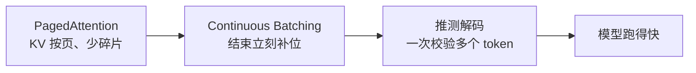

不是「换了个更快的 HTTP 框架」，也不是「模型量化一下就并发了」。量化、TP、prefix cache 是容量和重复计算的优化；**并发模型**是这三件：页表管 KV、iteration 级调度管 batch、草稿+一次校验管 Decode。

碎片用分页解，空闲用连续 batch 解，Decode 慢用推测解。vLLM 做的是推理引擎，不是把模型训得更聪明。

## 从 LLM Inference 到 LLM Programs

LLM 的用法已经从「聊一句回一句」变成「用程序调度多次生成」。先分清这两个词，再谈 vLLM / SGLang 各解什么。

**LLM Inference（推理）**

一次调用：Prompt 进去，模型 Prefill + Decode，token 出来。关心的是**这一趟**跑得快不快、稳不稳——TTFT、TPOT、吞吐、KV、batch。vLLM 的 PagedAttention、Continuous Batching、推测解码、PD 分离，全是在优化这一趟。

可以当成数据库的一次 SQL：引擎把这一句执行完。应用侧没有分支、没有第二次调用，Inference 就够了。

**LLM Programs（语言模型程序）**

用程序来**调度和控制**多次 LLM 生成，这类程序叫 Language Model Programs（LM 程序）。不是再调一次 `chat.completions`，而是把模型嵌进一段有控制流的代码里。

通常有两个共同属性：

1. **多次 LLM 调用 + 穿插控制流** — 先生成计划，再按条件选工具，循环直到任务结束；或多路并行再汇总。复杂任务和要质量时，单次生成往往不够。
2. **结构化输入、结构化输出** — 进 JSON / schema，出 JSON / 函数参数，才能和下一次调用、和现有软件（API、DB、工作流）拼在一起。靠散文 prompt 后校验，程序组合会碎。

例子：客服 Bot 多轮澄清 → 查知识库 → 调工单 API → 再生成回复。这里有分支、循环、工具、必须合法的 JSON。慢的经常不是某一趟 Decode，而是前缀反复 Prefill、JSON 不合格重试、控制流在 Python 里瞎等。

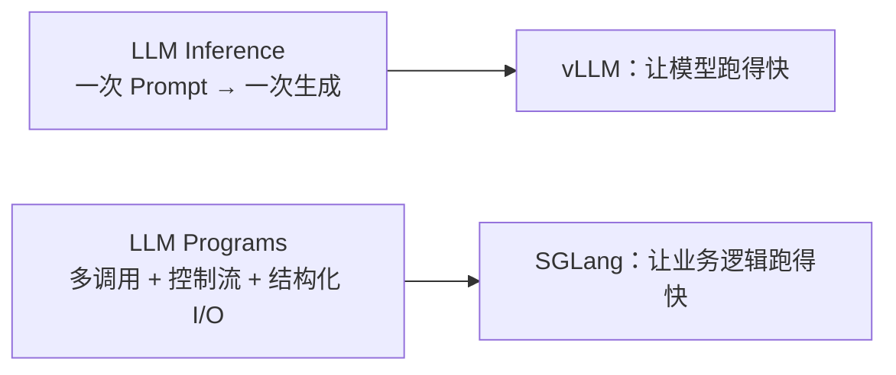

现在的应用已经从聊天进化到 LLM Programs。**vLLM 解决模型跑得快，SGLang 解决业务逻辑跑得快**——Inference 仍需要，但程序层的缓存、约束解码、fork/并行，才是 SGLang 的主场。

Inference 是单次执行；Program 是带控制流和结构化 I/O 的多次调用。只聊天优化 Inference；做 Agent / 工作流，要让 Program 跑得快。

## SGLang

为 LLM 设计的**结构化生成语言 + 运行时**：简化并加速复杂语言模型程序（LLM Programs）的编写和执行。前端管怎么写，后端管怎么跑。论文在多种大模型和多模态任务上大约 **6.4×** 吞吐，当论文数字，仓库：https://github.com/sgl-project/sglang

两截：

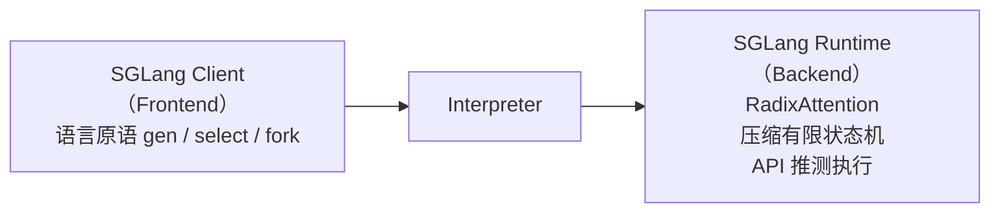

解释器把原语交给优化过的运行时执行。不是「又包一层 OpenAI SDK」。

**编程（Frontend）**

嵌在 Python 里的 DSL，和普通 Python / 库一起用。生成用 `gen`、`select`，并行用 `fork` / `join`，复杂提示工作流不用自己拼 messages 数组。

语言原语（管的是提示状态，不是新的神经网络）：

| 原语                            | 作用                 |
| ------------------------------- | -------------------- |
| `function`                      | 定义一个 SGLang 函数 |
| `system` / `user` / `assistant` | 系统、用户、助手消息 |
| `image`                         | 图像输入             |
| `select`                        | 从选项里选概率最高的 |
| `fork`                          | 拉出并行分支         |
| `gen`                           | 生成文本             |
| `run`                           | 执行这段程序         |

编程示例（论文里的多维论文评分）：评估一篇配图的文章。用 **分支-解决-合并**（fork-join）把大问题拆成几个小问题并行打分，再合并。函数 `multi_dimensional_judge(s, path, essay)`：`s` 是提示状态，`path` 是图片路径，`essay` 是正文。运行时看得见这棵调用树，公共前缀才能自动复用。

**运行时（Backend）三件优化**

1. **RadixAttention** — 多次 `gen` 之间自动重用 KV，少做重复 Prefill。多轮 / fork 出的兄弟枝共享前缀时最赚。
2. **压缩有限状态机** — 把 JSON/正则约束编成压缩 FSM，一次解码多个 token，约束解码比「生成后再校验」快。
3. **API 推测执行** — 模型只暴露 HTTP API、看不到 KV 时，用推测执行压缩多调用程序，少打几次 API、少花钱。

## SGLang编程特点

写起来像普通 Python，跑起来被运行时改成并行和自动加速。和 LMQL、Guidance 同属偏底层的「直接操作提示和原语」；差别是 SGLang **自带 Runtime（SRT）**，主打运行时效率，不改你写的那份 prompt 文本本身。

**1. Python 原生兼容**

控制流就用 `if` / `for` / `return`，不必学一套模板语法。例如模型判断是否相关之后：`if s["related"] == "no": return`，按生成结果走分支。

**2. 隐式并行**

`fork` 在代码里可以长得像 `for`，运行时会把多个维度的生成**并行**拉起来，并用 RadixAttention 复用共同上下文。手写多次 Prompt 很难自己做这层调度和前缀共享。

**3. 两种执行模式**

- **解释器模式** — 提示当成异步流，生成还没结束程序也可以往下走，不用同步死等每一次 `gen`。
- **编译器模式** — 先编成计算图再执行，方便做更多编译期优化。

**4. 运行时自动加速（写的时候不用手开）**

1. **KV 复用** — 多轮、多次 `gen` 自动缓存公共前缀。
2. **约束解码** — `regex` / schema 保证 JSON 合法，比 prompt 里写「请输出 JSON」靠谱。
3. **API 推测执行** — 即便背后是 OpenAI GPT-4 这种纯 API，也能压缩多调用次数和费用。

## SGLang系统中的RadixAttention技术

RadixAttention 解决的是：**已经算过的前缀 KV，下一轮 / 下一个分支还要不要重算。** 自回归每一步都依赖前面的 token，多轮对话、`fork` 出的兄弟请求往往共享同一段 system / 历史。没有前缀复用，每次都把这段 Prefill 再跑一遍，浪费算力和时间。PagedAttention 管 KV **怎么切块存放**；RadixAttention 管跨请求 **哪一段可以共享**。

三件配套：

1. **基数树（Radix Tree）** — 节点是 token 序列前缀，边上挂对应的 KV。查找、插入、共享、删除都按前缀走，能很快回答「这段 prompt 和树上哪一段重合」。
2. **LRU 逐出** — 显存满了先丢掉最久没用的叶子；公共前缀（常被命中的根附近）尽量留着。
3. **缓存感知调度** — 调整请求执行顺序，让共享前缀的任务挨着跑，提高命中率，少换页、少重算。

话剧团道具管理员的比喻：

- **没有 Radix**：每换一场戏都从仓库把全部道具再搬一遍，哪怕上一场刚用过龙椅。
- **有 Radix**：智能道具架按场景前缀分类。第一场「皇宫-早上-宴会」搬出龙椅、酒杯、桌布；第二场「皇宫-早上-议政」，「皇宫-早上」已经在台上，只加一张书桌。
- 架子满了：LRU 把最久没用的道具收回仓库，共用的基础布景留下。
- 导演（缓存感知调度）让相似场景连着拍，减少换道具。

对应：基数树 = 按「皇宫-早上」分类的货架；LRU = 收冷门、留常用布景；调度 = 相似的戏连着演。

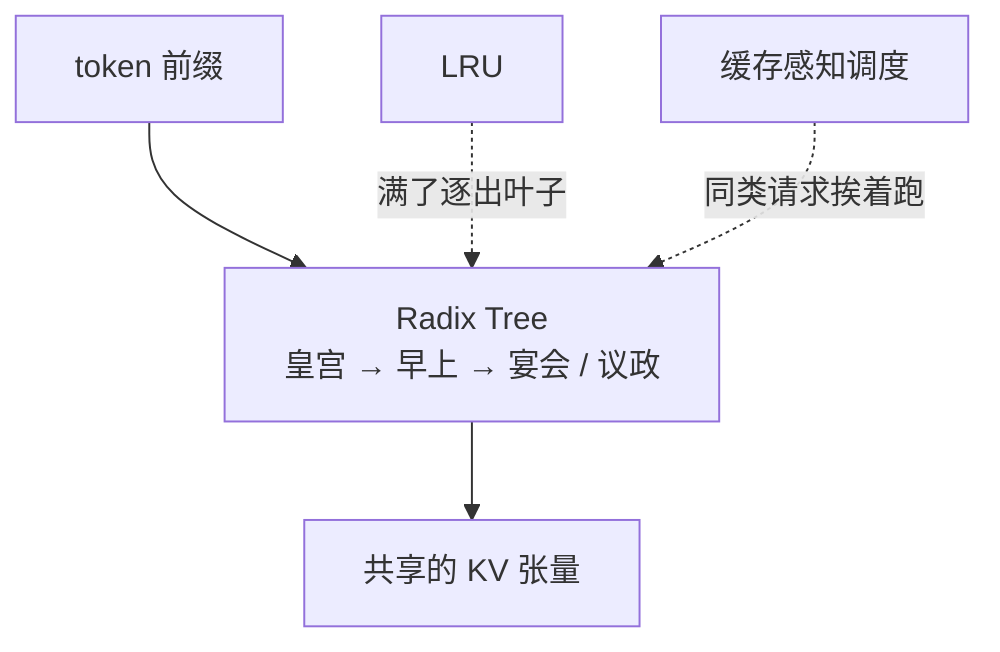

多轮客服、Agent 工具循环、`fork` 多维打分，命中率才能到公开口径的 75%–95%。短、散、完全不共享前缀的请求，树帮不上忙。

RadixAttention 是前缀 KV 的目录树，不是另一种注意力公式。树负责找「皇宫-早上」，LRU 负责腾地方，调度负责让相似请求连着来。

## RadixAttention

实现上就是一棵 **基数树当索引 + 分页存放 KV + 先丢叶子的 LRU**。注意力公式没变，变的是 KV 怎么找、怎么留、怎么扔。

**基数树 vs 传统前缀树（Trie）**

Trie：一条边只标一个元素，没分叉也要一层一层走。  
Radix Tree：边可以标**一段**序列（长度不固定），没有分叉的路径压成一条边，节点更少、前缀查找更快。公共 system prompt 往往很长且不分叉，正好收成一条边，对应一份 KV。

**和 KV 的映射**

树上每条路径是 token 序列，指向那一段的 KV 张量。物理上 KV **不必连续**：分页存放，论文实现里一页对应 **一个 token**（和 vLLM 常见 16 token 一块不同，这里粒度更细，方便按任意前缀切开共享）。逻辑上是整段前缀，物理上是散落的页。

**LRU：先逐出叶子**

GPU 显存很快被 KV 填满。简单 LRU，但 **先丢最近最少使用的叶子**。叶子是某条请求独有的后缀；丢掉之后，公共祖先还在树上，别的请求仍能命中「皇宫-早上」。祖先一直被共享就不会变成叶子；只有所有孩子都逐出了，它自己变成叶子，才可能被丢掉。这样淘汰顺序天然保护公共前缀。

```text
根
 └─ 皇宫-早上          ← 祖先，多条请求共用，先留着
      ├─ 宴会（叶子）  ← 独有后缀，LRU 先丢
      └─ 议政（叶子）
```

Radix 用可变长边压 Trie；KV 按 token 分页挂在边上；满了先砍叶子，祖先能共用就一直留。

## 缓存感知调度

有了基数树还不够：等待队列里请求的**执行顺序**会直接打到命中率。命中率 = **缓存住的 prompt token 数 / prompt token 总数**。

FCFS（先到先服务）或在无关请求之间来回切，会出现 **缓存抖动**：刚加载的前缀马上被 LRU 换出，下一秒又要回来。算法改成：在 Continuous Batching 里，按与树上已有 KV **匹配的前缀长度排序，更长的优先**，而不是按到达时间。

机场安检比喻：

- FCFS：A 东京 → B 纽约（换设备）→ C 东京（再换回来）→ D 伦敦。东京设备刚备好就被拆掉。
- 缓存感知：队列里有 A/C/E 东京、B 纽约、D 伦敦，先连续处理三个东京，KV 不用动，再换纽约。

**一次 iteration 在干什么（论文算法 1）**

输入：基数树 T、内存池 P、当前 batch B、等待队列 Q。

1. 取出 Q 里等待的请求。
2. 用 T 给每条请求做**前缀匹配**（哪些 token 的 KV 已经在树上）。
3. 按匹配长度排序，长的优先。
4. 看当前能分的显存（空闲 + 可 LRU 逐出的），从排好的列表里尽量多选进下一批。
5. 选中的从 Q 拿掉，并入正在跑的 B。
6. 按这批需要分配页；不够就从树上逐出叶子腾地方。
7. 执行这一批（Continuous Batching 的一步）。
8. 做完的请求：更新树上引用计数，把新产生的 KV **插回树**，供后面复用。
9. 返回完成的结果。

树负责「有没有这截前缀」；调度负责「别把刚命中的那截马上挤掉」。两者一起，才有公开口径里很高的前缀命中。

别按先来后到切通道。谁和当前树上前缀叠得最长，谁先飞，减少换设备。

## RadixAttention 出处与效果

LMSYS 在 **SGLang** 里提出。和 Guidance、vLLM 比，公开测试：A10 上 Llama-7B、Mixtral-8x7B，吞吐大约最高 **5×**（论文量级，前缀越共享越明显）。短、散、无公共前缀时不要按 5 倍去承诺。

树管映射，LRU 管显存，调度管命中；5 倍是 LMSYS 的对比数字，不是你的压测。

## 约束解码

应用经常要求输出必须是某种格式，最常见是 **合法 JSON**（函数参数、API 体）。做法是把格式写成正则 / schema，解码时只允许走合法的下一个 token，比 prompt 里写「请输出 JSON」再事后校验稳。

**传统约束解码的问题**：一步仍只出一个 token。很多位置其实整段都是确定的（如 `"name": "`、`true`、`}`），却还是一个字一个字过状态机，长 JSON、复杂正则时特别慢。

**SGLang：压缩有限状态机（Compressed FSM）**

把约束编成状态机之后，把「连续多个 token 都只有唯一合法走法」**压成一步**：一次前向可以落下好几个确定 token，而不是逐步问模型。状态机表示解码过程中允许的转移；能合并的转移就合并进同一步。

和 Prompt 工程的差别：prompt 是软约束，模型仍可能吐出半截 JSON；约束解码是硬约束，非法 token 的概率直接打掉。和「生成完用 Pydantic 校验、失败再 retry」比，少一次甚至多次重试。

RadixAttention 省的是**重复前缀的 Prefill**；压缩 FSM 省的是**结构化后缀的 Decode 步数**。LLM Programs 两条腿：前缀复用 + 格式一次解对。

要 JSON 别只靠提示。普通约束一步一字；压缩 FSM 把确定片段一次吐出。非法路径在解码里就不存在。

## 高效约束解码（Compressed FSM）

SGLang 给 `gen` 提供正则参数，正则对很多业务已经够用。流水线是：**正则 → 有限状态机（FSM）→ 解码时按当前状态屏蔽非法 token**。

普通 FSM 怎么走：维护当前状态，看下一跳允许哪些 token，把不允许的概率置零，然后 **一次只解 1 个 token**。常量片段 `{"summary": "` 在词表里会拆成很多个 token（`{`、`"summary"`、`": "` …），于是要多次 LLM 前向，即使每一步合法后继其实只有一个。

根因：FSM 和模型运行时没打通，没法「这一串边都是唯一的，一次跳过去」。长序列、复杂约束时 Decode 步数爆炸。

**压缩 FSM**：分析状态机，把相邻的、没有分叉的单 token 边 **压成一条边**。这条边上挂一串确定 token，一次前向全部落下。对任意正则都适用，不是只为 JSON 特化。

论文图里的同一段 `{"summary": "`：

|      | 状态机                               | 解码                                               |
| ---- | ------------------------------------ | -------------------------------------------------- |
| 普通 | (a) 十几个状态，一边一个字符         | (c) `{` → LLM → `summary` → LLM → `": "` → LLM → … |
| 压缩 | (b) 起点直接连到终点，边上是整段常量 | (d) 整段常量一次前向，再 LLM 解真正不确定的内容    |

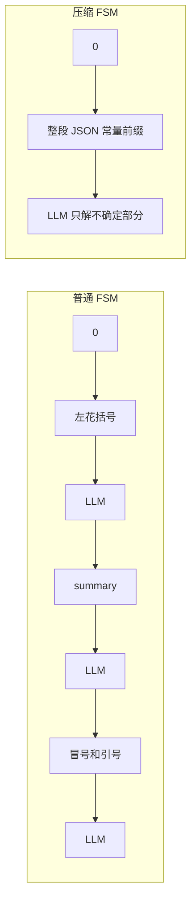

(a)/(c) 即使下一跳只有一个合法 token，也要单独开一次 Decode；(b)/(d) 把这些唯一边合成一步。不确定的字段（摘要正文）仍然逐步问模型，只是骨架 JSON 不再浪费步数。

正则变状态机，非法 token 概率打零；压缩是把「没有分叉的那一串」一次吐完。`"summary":` 这种键名不该一步一个 LLM。

## API推测执行

GPT-4 / Claude 这类 **黑盒 API** 改不了模型内部，看不到 KV，RadixAttention 用不上。LLM Program 里每次 `gen()` 就是一次 HTTP，又贵又慢。API 推测执行（API Speculative Execution）是 SGLang 为这种场景做的 **少打几次接口** 的策略，和 GPU 上 EAGLE 那种草稿+校验不是同一件事。

思路：第一次调用时不要只生成到最近的 `stop`，继续多吐一些 token 缓存下来，后续 `gen` 能对上就直接用，不再打第二次 API。也可以并行猜几条可能后续，减少串行等待。

**例子：角色名 + 职业**

传统两次调用（上下文 token 也付两遍钱）：

```text
s += context + "name:" + gen("name", stop="\n") + "job:" + gen("job", stop="\n")
```

SGLang：第一次就开推测，**忽略 stop 继续往后写**；解释器把多出来的文本留下来，和下一个原语（`job:`）做匹配、重用。猜中则第二次调用省掉。

好处：延迟（少一轮 RTT）、费用（少一次请求、少重复计输入）、少空等。

**挑战**

1. **准不准** — 多吐的内容和下一跳对不上，等于白付 token，还要补一次真调用。
2. **缓存** — 多出来的 token 要能正确匹配后续原语，匹配失败要丢掉再请求。

**什么时候用**

- 必须走 GPT / Claude 等商业 API
- 程序很规律，例如固定抽 `name` / `job` / `age` 三个字段
- 能接受大约 **10–20% token 浪费** 换更低延迟

**什么时候不要用**

- 本地开源模型 → 用 RadixAttention 更划算（前缀缓存几乎免费）
- 程序 `if/else` 很多，下一跳猜不准，浪费会超过省下的 RTT

生产常见两条路：全部本地模型吃 Radix；或直接调官方 API，用它自己的 Prompt Caching。API 推测是「程序结构规整、又必须黑盒」时的第三条缝。

黑盒 API 看不到 KV，就让第一次 `gen` 多写一点给后面的原语用。规律填表能省调用；分支一多别开。别和 EAGLE 搞混。

## SGLang常见启动参数

和 vLLM 是同一类旋钮，名字不同。默认端口常避开 vLLM 的 8000。

| 参数                          | 对标 vLLM                         | 说明                         |
| ----------------------------- | --------------------------------- | ---------------------------- |
| `--mem-fraction-static`       | `--gpu-memory-utilization`        | 静态显存占比                 |
| `--tp-size`                   | `--tensor-parallel-size`          | 多卡才设                     |
| `--context-length`            | `--max-model-len`                 | 越短越省 KV                  |
| `--chunked-prefill-size`      | chunked-prefill                   | 压 TTFT                      |
| `--max-running-requests`      | `--max-num-seqs`                  | 最大并发                     |
| `--enable-metrics`            | `--enable-metrics`                | Prometheus；看 `cache_hit_rate` |

先划显存、上下文、并发，再开 chunked-prefill。单卡不加 `tp-size`。启动加 `--enable-metrics`，核心看 `cache_hit_rate`：多轮 / 同模板该高，单轮散问接近 0 是正常。

## SGLang的作用

和上一节成对记：**vLLM 让模型跑得快，SGLang 让业务逻辑跑得快。**

「业务逻辑」不是网关代码，是模型被嵌进的那套程序：多轮对话、Agent 工具循环、RAG 同一段 system、要吐合法 JSON。这些调用之间大量前缀重复，瓶颈经常不是「再挤一点 Decode」，而是 **同一段 KV 翻来覆去 Prefill**、**JSON 不合格反复重试**。

SGLang 对着这两类浪费下手：

1. **RadixAttention** — KV 按前缀树复用。system prompt、历史、检索模板相同的请求，命中前缀就跳过重算。多轮 / Agent / RAG 前缀命中常到 75%–95%（公开量级）。vLLM 后来也有 prefix caching；SGLang 把树当一等公民，分叉、回滚、并行枝更顺。
2. **约束解码 + 程序式前端** — JSON / 函数参数按语法生成，少走「生成失败再请你重来」的业务重试。DSL 里写条件、循环、并行调用，运行时能看见整张调用图，好做缓存和 fork。

```mermaid
flowchart LR
  v["vLLM：模型跑得快<br/>分页 + 连续 batch + 推测"] --> gpu["GPU 少空转"]
  s["SGLang：业务逻辑跑得快<br/>Radix 前缀 + 约束解码"] --> app["多轮 / Agent / JSON 少重算"]
```

怎么选：短、散、无共享前缀、要通用 OpenAI 兼容 → 先 vLLM。前缀又长又重复、Agent 步数多、结构化输出是主路径 → SGLang 更对口。两者都能 Continuous Batching；差在 **优化的是引擎空转，还是应用侧重复计算**。

vLLM 解决卡怎么喂饱；SGLang 解决同一段 prompt / 同一套 JSON 协议别每步重跑。业务是多轮和 Agent 时，快的是逻辑，不只是 kernel。

## SGLang vs vLLM

一句话：**vLLM 是跑模型的，SGLang 是跑业务逻辑的。** 比喻：vLLM 像 MySQL（通用存储引擎）；SGLang 像 Redis+Lua（带脚本的运行时，程序和缓存长在一起）。

| 维度 | vLLM                       | SGLang                         | 怎么选                                              |
| ---- | -------------------------- | ------------------------------ | --------------------------------------------------- |
| 定位 | 通用推理引擎               | 复杂 LLM 程序运行时            | 简单对话用 vLLM；Agent / 多轮 / 结构化输出用 SGLang |
| 缓存 | PagedAttention（块级复用） | RadixAttention（前缀树复用）   | 多轮对话 SGLang 前缀命中通常更高                    |
| 编程 | OpenAI API 调用            | Python 原生嵌入（`@function`） | 要分支、循环、并行控制流选 SGLang                   |
| JSON | Prompt + 后校验            | 原生约束解码（正则/语法强制）  | 接口必须合法 JSON 时 SGLang 更稳                    |
| 兼容 | OpenAI API                 | OpenAI API + 原生语法          | SGLang 也能当 OpenAI 服务，迁移成本低               |

简单问答 → vLLM 就够。多轮、并行任务、严格 JSON → SGLang 往往更省（少重复 Prefill、少重试）也更稳。

不要说成「SGLang 一定更快」：短、散、没有共享前缀的请求，PagedAttention + Continuous Batching 已经够，Radix 的树没有命中可赚。vLLM 后来也有 prefix caching，差距主要在 **树是不是一等公民、约束解码和程序式前端是不是原生**。

先问请求长什么样。像查库的短问答 → MySQL（vLLM）；像带脚本的多步 Agent → Redis+Lua（SGLang）。兼容性不是障碍，SGLang 也能出 `/v1`。

## [重点] 什么时候用 SGLang，什么时候用 vLLM？

先问业务长什么样，再选引擎。**单轮、要稳、要对齐 OpenAI → vLLM；有前缀可复用或要硬格式 → SGLang。**

```mermaid
flowchart LR
  q["业务场景？"] --> a["简单问答 / 单轮"]
  q --> b["多轮 / 客服"]
  q --> c["批量 / 数据处理"]
  q --> d["严格 JSON / Agent"]
  a --> v["vLLM<br/>成熟稳定，API 兼容好"]
  b --> s1["SGLang<br/>RadixAttention 缓存"]
  c --> s2["SGLang<br/>共享前缀降成本"]
  d --> s3["SGLang<br/>约束解码保证合法"]
```

| 场景                      | 选谁       | 理由                                                       |
| ------------------------- | ---------- | ---------------------------------------------------------- |
| 简单问答、单轮对话        | **vLLM**   | 缓存价值小，生态和 OpenAI 兼容更熟；要 EAGLE/Medusa 也先它 |
| 多轮对话、客服            | **SGLang** | 历史前缀反复出现，Radix 命中通常 60–80%                    |
| 批量任务、同一模板刷数据  | **SGLang** | 共享前缀，公开量级成本可到约 3 倍差距                      |
| 严格 JSON、Agent 工具参数 | **SGLang** | 压缩 FSM，合法输出是硬约束                                 |

两者都能出 `/v1`。已经用 vLLM 且流量是单轮散问，不必只因为某一张对比表就迁移。`cache_hit_rate` 上线后接近 0，换 SGLang 也赚不到。

先画请求有没有公共前缀、要不要合法 JSON。没有 → vLLM；有 → SGLang。

## PD 分离架构

PD 分离（Prefill-Decode Decoupling）把推理拆成两种实例：**P 只做预填充，D 只做逐字生成**。根因是这两段对 GPU 的胃口相反，绑在同一张卡上会互相拖死。

**1. Prefill（预填充）**

处理用户输入，一次性读完整段 Prompt，算出所有 token 的 KV Cache。

- 计算：**Compute-Bound**，大量矩阵乘，瓶颈是 GPU 算力
- 指标：**TTFT**（到第一个 token）
- 资源：要高算力、高并行度
- 比喻：短跑，爆发力强，瞬间做完一大块计算

**2. Decode（解码）**

基于已有内容自回归，一次预测 **1 个** token。

- 计算：**Memory-Bound**，每步算得少，瓶颈是读 KV，计算单元大量空闲
- 指标：**TPOT**（相邻 token 间隔）
- 资源：要大显存、高内存带宽
- 比喻：马拉松，一步一步往前耗

|                  | Prefill                        | Decode                                  |
| ---------------- | ------------------------------ | --------------------------------------- |
| 干什么           | 整段 prompt → 写出 KV          | 逐步吐字，KV 追加                       |
| 瓶颈             | 算力                           | HBM / KV 读取                           |
| 指标             | TTFT                           | TPOT                                    |
| 一张卡上的副作用 | 长 prompt 独占 GPU，别人停吐字 | batch 一大 TPOT 变差；小 batch 算力闲着 |

混部的冲突：一条 8k Prefill 闯进来，正在流式输出的请求 TPOT 立刻毛刺——短跑选手冲进马拉松赛道。Chunked Prefill 是**同一张卡分时**（切 512 一块，插空给 Decode）；PD 分离是**分卡分池**，从根上不抢。

**3. 架构怎么拆**

```mermaid
flowchart LR
  req["请求"] --> p["P 池：Prefill 实例<br/>Compute-Bound 卡"]
  p -->|"把 KV 传过去"| d["D 池：Decode 实例<br/>大显存 / 高带宽"]
  d --> tok["流式 token"]
```

1. 调度把新请求送到 **P**：专优化 TTFT，用计算更强的卡。单条 prompt 已经很长，请求侧 batch 通常不大。
2. Prefill 结束，把 KV（PagedAttention 的 Block）迁到 **D**。传输走 NVLink / RDMA，太慢会把 TTFT 吃回去，这是落地难点。
3. **D** 只 Decode：没有 Prefill 抢卡，可以用大 batch 把带宽吃满，并叠推测解码。长 Prefill 再猛也堵不住正在吐字的连接。

和目标 B 那套参数是同一方向：单卡先 chunked-prefill + 小 batch + 推测；流量大、长 prompt 多，再上 PD 分离。P/D 比例按流量调：prompt 很长就多 P，生成很长就多 D。

Prefill 是短跑，Decode 是马拉松，不要塞同一条赛道。分开之后 TTFT 和 TPOT 才能各自调；KV 怎么快速从 P 交到 D，是这个架构真正要工程化的地方。

## [重点] 为什么需要PD分离？

混合执行：Prefill 和 Decode 在**同一张 GPU 上交替**跑。Continuous Batching 吞吐能涨，但两段资源画像相反，交替一次就互相伤害一次。

1. **跑 Prefill 时** — 计算密集，独占 Tensor Core，正在流式输出的 Decode 被堵住 → **TPOT 飙升**，用户感觉卡顿。
2. **跑 Decode 时** — 访存密集，每步只算 1 个 token，计算单元大量空闲 → **浪费了 Prefill 最需要的算力**，新请求 TTFT 也上不去。

=> 短跑运动员和马拉松运动员在同一条跑道上交替训练，谁都练不好。

Chunked Prefill 是同一条跑道「跑一段就让道」，毛刺还在。PD 分离换成两条跑道：P 实例只短跑，D 实例只马拉松，KV 交棒。长 prompt + 高并发、TTFT 和 TPOT 都要稳，才值得拆；小流量短请求，混跑 + chunked 通常够。

## PD分离的原理

工作流是 **路由 → Prefill 出 KV → 高速把 KV 交给 Decode → 只在 D 上吐字**。两池硬件也可以不一样：P 要算力，D 要显存和带宽。

```mermaid
flowchart TB
  u["用户请求 Prompt"] --> r["Router：新请求只发给 Prefill 节点"]
  r --> p["① Prefill 集群 · 计算密集 GPU<br/>全序列注意力 → 完整 KV<br/>适合 H100 一类高算力 · 小 Batch"]
  p --> kv["② KV Cache 传输<br/>NVLink / RDMA / InfiniBand"]
  kv --> d["③ Decode 集群 · 带宽密集 GPU<br/>自回归读 KV 吐字，可叠 EAGLE/Medusa<br/>适合 A100 80G 一类大显存 · 大 Batch"]
```

1. **Router** — 新请求进 P，不进 D。D 上没有「突然来一条 8k Prefill」这种插队。
2. **Prefill 集群** — 专门做全序列注意力，写出完整 KV。一条长 prompt 本身已经是大矩阵乘，**请求 batch 小**、卡要算力强（如 H100），盯 TTFT。
3. **KV 传输** — 把 Cache 从 P 迁到 D。必须走高速互联；走普通 TCP 会把分离省下的 TTFT 吃光。这是这个架构最容易翻车的点。
4. **Decode 集群** — 只读 KV、逐步生成。没有 Prefill 抢算力，**可以用大 batch 把 HBM 吃满**；仍偏 Memory-Bound，适合叠推测解码。卡要大显存（如 A100 80G），盯 TPOT。

和混部调参的差别：混在一张卡上 Decode 开大 batch 会把 TPOT 打爆（还叠加 Prefill 抢占）；分开之后 Decode 池的大 batch 不再挡住别人的首字。P/D 数量按流量：prompt 很长就多 P，生成很长就多 D。

请求先到短跑队写出 KV，高速交棒给马拉松队只负责吐字。原理不是「多买几张卡」，是 **算力型 GPU 和带宽型 GPU 各干各的，中间只传 KV**。

## PD 分离的核心优势

拆开之后能拿到四件事。幻灯片里有时把 TPOT 写成「首 token 延迟」——那是 **TTFT**。Prefill 不再堵 Decode，稳住的是吐字间隔 **TPOT**；首字仍看 P 池自己的 Prefill。

1. **消除干扰** — 两阶段物理隔离，Prefill 不再插入 Decode 的 iteration，流式输出的 TPOT 稳定，用户不卡顿。
2. **资源特化** — Prefill 用高算力 GPU（H100），Decode 用大显存 GPU（A100 80G），各取所需，不必所有卡都买最贵的那一档。
3. **独立扩展** — 按负载调 P/D 实例比例：长 prompt 洪峰加 P，长生成洪峰加 D，不必整池一起扩。
4. **Batching 差异化** — Prefill **小 Batch**（已经 Compute-Bound）；Decode **大 Batch**（缓解 Memory-Bound）。混部做不到这一点：同一张卡不敢让 Decode 开很大。

**为什么 Prefill 适合小 Batch，Decode 适合大 Batch？**

- **Prefill**：整段 Prompt 的矩阵乘已经把算力打满。再加大请求 batch，只是让更多人排队，吞吐几乎不涨，TTFT 反而坏。
- **Decode**：每步只算 1 个 token，算力闲着、卡在读 KV。加大 batch 等于一步里同时服务更多人，空闲算力被用上，从 Memory-Bound 往 Compute-Bound 靠，吞吐明显上去。

混在一张卡上时，Decode 开大 batch 会和 Prefill 抢，TPOT/TTFT 一起坏。分开之后，D 池才敢用大 batch 换吞吐。

隔离让吐字不卡，硬件按胃口买，P/D 按流量加减，batch 也能各开各的。核心是 **小 batch 短跑、大 batch 马拉松**，不要逼它们用同一个 batch。

## vLLM 中的 PD 分离实现

vLLM 不把 PD 写死在调度器里，而是用 **KV Transfer Connector** 当插件：Prefill 实例当 **生产者** 算 KV，Decode 实例当 **消费者** 收 KV 再生成。同一套引擎，角色靠配置切换。

```text
# Prefill 节点（生产者）
kv_config = KVTransferConfig.from_cli(
    '{"kv_connector":"PyNcclConnector","kv_role":"kv_producer","kv_rank":0}'
)

# Decode 节点（消费者）
kv_config = KVTransferConfig.from_cli(
    '{"kv_connector":"PyNcclConnector","kv_role":"kv_consumer","kv_rank":1}'
)
```

四个要点：

1. **异步传输** — Prefill 算完就通过 Connector **推** KV 到 Decode，不必同步卡死等 D 用完。P 可以接着算下一条。
2. **零拷贝** — `PyNcclConnector` 走 NCCL，可走 NVLink / InfiniBand，GPU 到 GPU，少经 CPU 拷贝。跨机常见换 RDMA 类 Connector（如 Mooncake）。传得比 Prefill 还慢，分离就亏。
3. **调度协同** — Router 决定这条请求在本地 Prefill 还是送到远程 P 节点；D 只消费已经就绪的 KV，不会突然接一条 8k 新 prompt。
4. **兼容 Continuous Batching** — P 和 D **各自**对自己的队列做 iteration 级调度。分离的是阶段，不是退回静态 batch。

`kv_role` 是身份，`kv_rank` 是这组传输里的编号。Connector 可换，注意力和 PagedAttention 不用改。Connector 不是新的 Attention，它只是 **PD 之间的 KV 搬运层**。

一边 `kv_producer` 出 KV，一边 `kv_consumer` 接着 Decode；中间异步、尽量零拷贝；两池仍各自 Continuous Batching。
