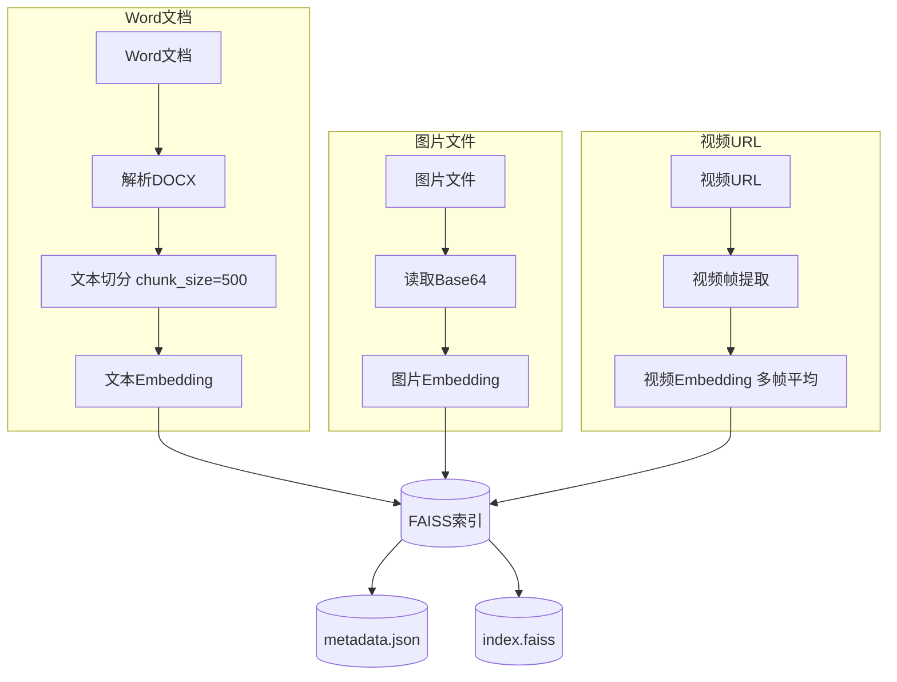
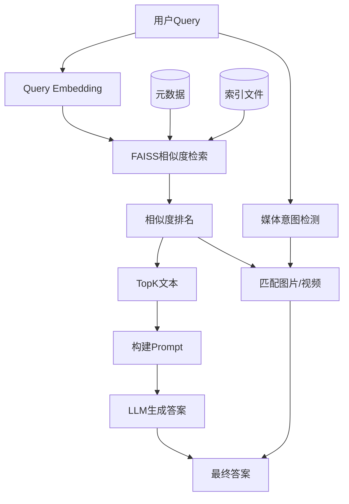

# 07.多模态RAG知识库

下次要把 Word、图片、视频打进同一个 FAISS，再按问题检索并附上媒体时看这里。

官方多模态 embedding 走 DashScope `tongyi-embedding-vision-plus`：文本、图片 Base64、视频 URL 进同一向量空间。问答仍用 Token Plan。本示例用乐园 FAQ，不搬课上迪士尼素材。

## 前置条件

- 仓库根目录 `.env`：`BAILIAN_TOKEN_PLAN_API_KEY`、`CHAT_BASE_URL`、`CHAT_MODEL`（问答用）
- 多模态向量化必须另配 `DASHSCOPE_API_KEY`（普通百炼 `sk-`）。Token Plan 的 `sk-sp-` 不能调视觉 embedding，缺了会报错退出
- 密钥只进 `client.py`
- Python 3.10+：`pip install -r exampleAgentFramework/07.多模态RAG知识库/requirements.txt`
- 视频接口只收公开 URL，不支持本地 mp4；演示用 `knowledge/videos.json` 里的汽车剐蹭样例

## 使用方法

```bash
pip install -r exampleAgentFramework/07.多模态RAG知识库/requirements.txt
npm run multimodal-rag
```

无索引则先建库，再跑三条问句：门票退款（纯文本）→ 万圣节海报（文本+图）→ 汽车剐蹭（文本+视频 URL）。控制台会打印全库相似度排名、意图检测和终答。已有 `vector_db/` 时跳过 embedding；强制重建：

```bash
set MULTIMODAL_REBUILD=1
npm run multimodal-rag
```

也可拆开跑：

```bash
npm run multimodal-rag:build
npm run multimodal-rag:query
python exampleAgentFramework/07.多模态RAG知识库/embed.py text
python exampleAgentFramework/07.多模态RAG知识库/embed.py image
python exampleAgentFramework/07.多模态RAG知识库/embed.py video
```

`query.py` 后面跟句子就是单次提问。

索引构建：



Query 查询：



图片意图关键词：图片 / 海报 / 照片 / 看看 / 长什么样 / 图。视频：视频 / 录像 / 影片 / 看一下 / 播放。媒体距离小于 3.0 才附上，取 Top-1。LLM 只吃 top-k 文本，不把像素喂给 chat。

## 目录架构

```text
07.多模态RAG知识库/
  client.py              根目录 .env；chat=Token Plan；embedding 只用 DASHSCOPE_API_KEY
  embed.py               MultiModalEmbedding：text / image / video；可单独跑 text|image|video
  ingest.py              解析 knowledge/docs/*.docx、扫图片、读 videos.json
  store.py               IndexFlatL2 建库/加载/检索；Windows 中文路径经 ASCII 临时目录中转
  build_index.py         三路入库，写出 vector_db/index.faiss + metadata.json
  query.py               加载索引、意图检测、RAG；默认三条演示问句
  main.py                无库则 build，再 query
  knowledge/docs/        门票退改 / 节庆活动 / 停车剐蹭 .docx
  knowledge/images/      万圣节海报.png、奇妙聚会海报.png
  knowledge/videos.json  公开汽车剐蹭 mp4 URL
  requirements.txt
  vector_db/             跑完生成，不入库
```

## 查阅要点

- does: 同一模型把文本/图片/视频写入一个 FAISS；DOCX 切块 500/50；query 文本 embedding + 关键词意图；L2 转相似度 `1/(1+d)`；命中媒体拼在答案末尾
- not: 不把 Token Plan 密钥拿去调视觉 embedding；不把本地视频文件直接向量化；不做 LangChain FAISS（那是 06）
