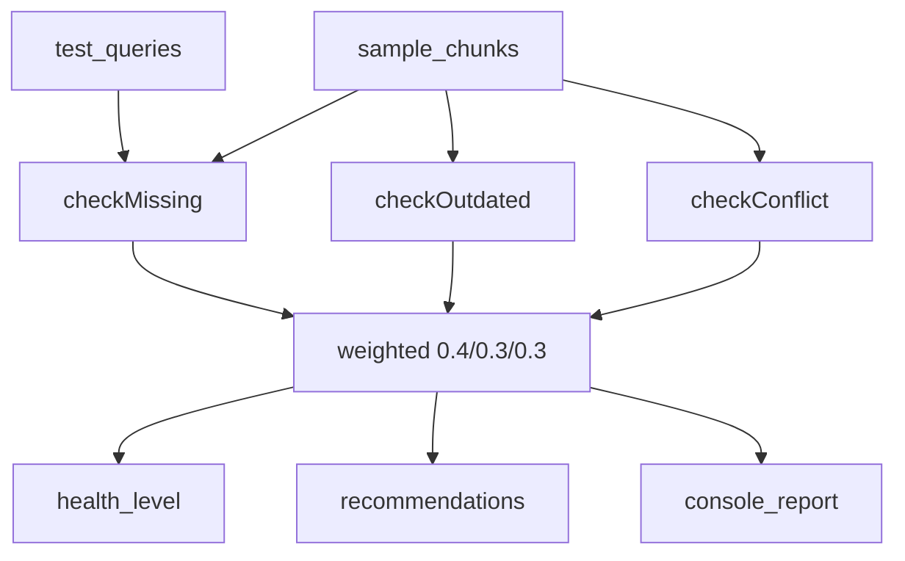

# 08.知识库健康度检查

下次要用 LLM 检查知识库缺不缺、过不过期、有没有互相打架时看这里。

三次结构化调用：覆盖率、新鲜度、一致性，再按 0.4 / 0.3 / 0.3 加权打分。演示库是滨江乐园 FAQ，故意埋了价格冲突、过期票价、缺失活动和停车费。

## 前置条件

- 仓库根目录 `.env`：`BAILIAN_TOKEN_PLAN_API_KEY`、`CHAT_BASE_URL`、`CHAT_MODEL`
- 密钥只进 `client.ts`，业务代码不读环境变量

## 使用方法

```bash
npm run kb-health
```

控制台会依次打印缺知识、过期、冲突三次检查，再给出总分、等级和改进建议。覆盖率应看到活动和停车费缺失；一致性应看到 kb_002 与 kb_003 票价冲突。



## 目录架构

```text
08.知识库健康度检查/
  client.ts    Token Plan 接入，密钥只停在这里
  schema.ts    三份检查结果的 zod 契约 + 给模型看的字段说明
  sample.ts    5 条切片 + 6 条测试问句（含故意缺陷）
  checker.ts   三次 LLM 调用、剥围栏、zod 验收、加权打分
  index.ts     打印评分 / 缺知识 / 过期 / 冲突 / 建议
```

## 查阅要点

- does: `json_object` + zod（分数 `coerce`）；覆盖率 40%、新鲜度 30%、一致性 30%；等级阈值 0.8 / 0.6 / 0.4
- not: 不做向量检索；不调 dashscope 专有 SDK；不实现 BM25 / 对话沉淀 / 版本管理
