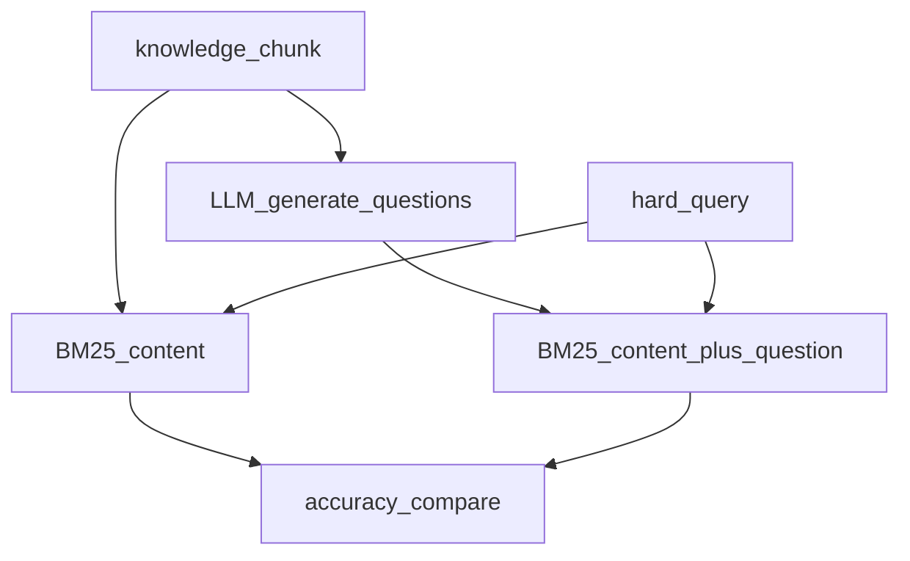

# 09.问题生成与BM25检索

下次要给知识切片预写问题、再用 BM25 对比「搜原文」和「搜问题」时看这里。

先让模型按切片生成问法，再把「内容+问题」编进第二套 BM25。难查询往往原文对不上、问题索引对得上。中文分词用汉字 bigram，不装 jieba。

## 前置条件

- 仓库根目录 `.env`：`BAILIAN_TOKEN_PLAN_API_KEY`、`CHAT_BASE_URL`、`CHAT_MODEL`
- 密钥只进 `client.ts`，业务代码不读环境变量

## 使用方法

```bash
npm run kb-bm25
```

控制台先打出 5 条 / 8 条生成问题，再给每条切片生成问题并比较两种检索的准确率。会打多次模型，大约一两分钟。



## 目录架构

```text
09.问题生成与BM25检索/
  client.ts     Token Plan 接入
  tokenize.ts   拉丁整词 + 汉字 bigram
  bm25.ts       Okapi BM25（k1=1.5, b=0.75）
  generate.ts   为切片生成问题
  retrieve.ts   原文索引 / 问题索引 / 评测
  sample.ts     滨江乐园切片与难查询
  index.ts      三条演示
```

## 查阅要点

- does: 预写问题再检索；同一套 BM25 比原文 vs 问题；难查询（过山车去哪、人少、能否带食物）
- not: 不装 jieba / rank_bm25；不做向量检索（那是 06 / 11）
