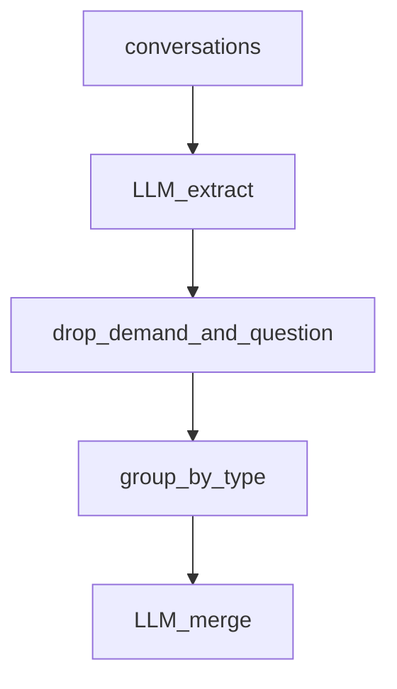

# 10.对话知识沉淀

下次要从客服对话里抽知识点、丢掉一次性需求和问题、再按类型合并时看这里。

流程：单条抽取 → 批量抽取并计频次 → 过滤「需求/问题」→ 同类型交给模型合成一条。

## 前置条件

- 仓库根目录 `.env`：`BAILIAN_TOKEN_PLAN_API_KEY`、`CHAT_BASE_URL`、`CHAT_MODEL`
- 密钥只进 `client.ts`，业务代码不读环境变量

## 使用方法

```bash
npm run kb-extract
```

先看第一条对话抽出的事实/流程，再看三轮对话合并后的沉淀条目。合并时「带小孩注意什么」这类需求会被丢掉，门票和停车规则会留下来。



## 目录架构

```text
10.对话知识沉淀/
  client.ts    Token Plan 接入
  schema.ts    抽取 / 合并结果的 zod 契约
  sample.ts    三轮滨江乐园客服对话
  extract.ts   抽取、批量、过滤、合并
  index.ts     三条演示
```

## 查阅要点

- does: 从对话抽结构化知识；过滤临时的需求和问题；同类型 LLM 合并，置信度取最高
- not: 不写入向量库；不做在线客服闭环
