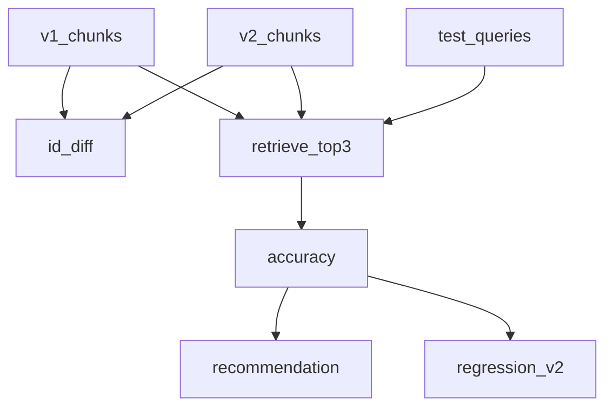

# 11.知识库版本管理

下次要对比两版知识库的增删改、并用同一组问句评检索准确率时看这里。

版本 diff 是纯计算。检索：配了 `DASHSCOPE_API_KEY` 走 embedding 余弦；否则用字面重叠，版本对比和回归测试仍能跑。不做 FAISS（那是 06）。

## 前置条件

- 仓库根目录 `.env`：`BAILIAN_TOKEN_PLAN_API_KEY`、`CHAT_BASE_URL`、`CHAT_MODEL`（本示例评测不调 chat）
- 真向量检索再配 `DASHSCOPE_API_KEY`（普通百炼 `sk-`，不要用 Token Plan 的 `sk-sp-`）
- 密钥只进 `client.ts`，业务代码不读环境变量

## 使用方法

```bash
npm run kb-version
```

控制台依次打印：创建 v1/v2、diff（应看到新增交通/项目、票价和简介被改写）、两版准确率、建议、v2 回归用例。v2 应能答上「怎么去」和「好玩项目」，v1 答不上。



## 目录架构

```text
11.知识库版本管理/
  client.ts     chat 与 embedding 密钥分开
  sample.ts     v1 / v2 切片与评测问句
  versions.ts   创建版本、统计、按 id diff
  retrieve.ts   embedding 余弦或字面重叠、评测、建议
  index.ts      五段演示
```

## 查阅要点

- does: 按切片 id 做增删改；同一问句集比两版命中；expected 子串出现在 top-3 即算对
- not: 不用 FAISS；不把 Token Plan 密钥拿去调 embedding
