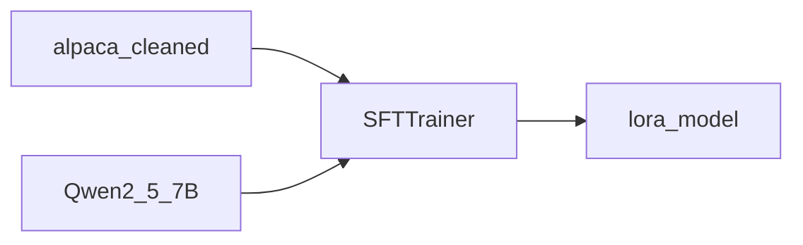

# 01.Alpaca-SFT

下次要用 Unsloth 对 Qwen2.5-7B 做 Alpaca LoRA SFT 时看这里。

`max_steps=60` 演示量级；输出进本目录 `outputs/` / `lora_model/`。

## 前置条件

- NVIDIA GPU；`pip install -r exampleFineTune/requirements.txt` 并按 Unsloth 官方装好 `unsloth`
- 数据：`exampleFineTune/data/alpaca-cleaned/`（已从课盘拷入，不入库）
- 模型：`FT_MODEL_7B` 或本地 AutoDL 路径，否则 HuggingFace `Qwen/Qwen2.5-7B-Instruct`
- 不读仓库 `.env` 密钥

## 使用方法

```bash
npm run ft:sft
```

控制台打印 GPU 显存、训练耗时，并做 Fibonacci / Paris 推理；LoRA 写到 `lora_model/`。



## 目录架构

```text
01.Alpaca-SFT/
  main.py       Unsloth LoRA SFT
  outputs/      训练 checkpoint（不入库）
  lora_model/   LoRA 适配器（不入库）
```

## 查阅要点

- does: Alpaca 格式化 + LoRA SFT + 简短推理与保存
- not: 不全量训；不提交 7B 权重；不强制固定 AutoDL 路径
