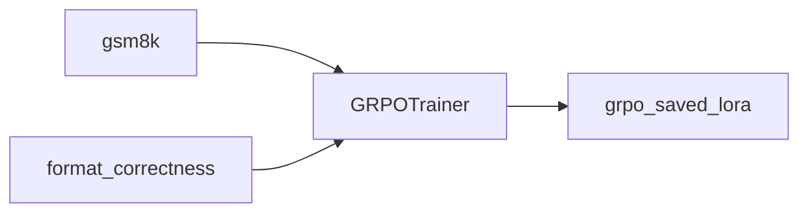

# 02.GRPO-R1

下次要用 GRPO + GSM8K 训 R1 式 `<reasoning>/<answer>` 时看这里。

依赖 Unsloth `fast_inference`（vLLM）与奖励函数组合；`max_steps=250`。

## 前置条件

- NVIDIA GPU（建议 40GB+）；`unsloth` + `vllm`
- 数据：`exampleFineTune/data/gsm8k/`（不入库）
- 模型：`FT_MODEL_7B` 或 HF `Qwen/Qwen2.5-7B-Instruct`

## 使用方法

```bash
npm run ft:grpo
```

训练后保存 `grpo_saved_lora/`，并用 vLLM 采样测一句。



## 目录架构

```text
02.GRPO-R1/
  main.py            GRPO + 奖励函数
  outputs/           checkpoint（不入库）
  grpo_saved_lora/   LoRA（不入库）
```

## 查阅要点

- does: XML 格式奖励 + 正确性奖励；GSM8K；保存 LoRA
- not: 不是软标签 KD；不在无 GPU 机上假跑
