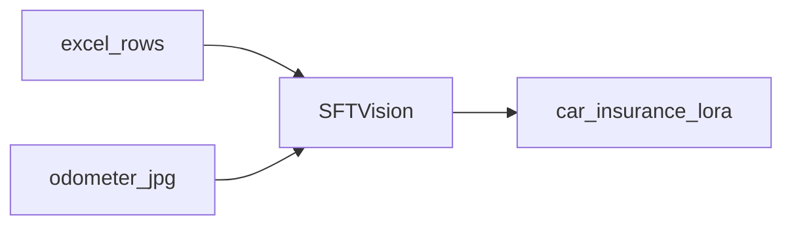

# 03.QwenVL微调

下次要微调 Qwen2.5-VL-3B 做里程表/承保信息抽取时看这里。

Excel + 本地 `images/`；`max_steps=30`。

## 前置条件

- NVIDIA GPU；Unsloth `FastVisionModel`
- 本目录已有 `qwen-vl-train.xlsx` 与 `images/`
- 模型：`FT_MODEL_VL` 或 HF `Qwen/Qwen2.5-VL-3B-Instruct`

## 使用方法

```bash
npm run ft:vl
```

训练前后各打印一次里程表推理；LoRA 写到 `car_insurance_lora_model/`。



## 目录架构

```text
03.QwenVL微调/
  main.py                     视觉 LoRA SFT
  qwen-vl-train.xlsx          训练表
  images/                     里程表示例图
  outputs/                    checkpoint（不入库）
  car_insurance_lora_model/   LoRA（不入库）
```

## 查阅要点

- does: Excel→对话样本；训前/训后推理；保存视觉 LoRA
- not: 不依赖 `/root/autodl-tmp` 硬编码图片路径
