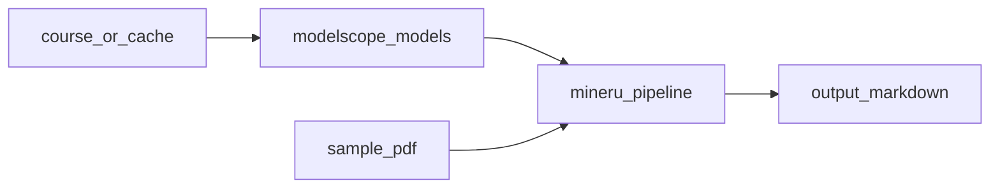

# 01.MinerU使用

下次要做 PDF 私有化解析（本机模型 → Markdown）时看这里。

用当前 `mineru` pipeline；模型优先用示例内 `modelscope_models/`（从课盘拷入，约 2.2GB，不入库）。

## 前置条件

- Python 3.10+，先 `pip install -r exampleMultimodal/01.MinerU使用/requirements.txt`
- 本机有课盘 `CASE-MinerU使用/modelscope_models`，或能从 ModelScope 下载
- 不读仓库 `.env` 密钥

## 使用方法

```bash
npm run mineru:download
npm run mineru
```

`mineru:download`：本地已齐 → 只写配置；否则从课盘拷贝；再否则网上下载。可用 `MINERU_COURSE_MODELS` 覆盖课盘路径。

成功时控制台打印 Markdown 路径与预览；完整结果在 `output/`（不入库）。



## 目录架构

```text
01.MinerU使用/
  main.py              解析 sample.pdf → output/
  download_models.py   确保模型 + 写 mineru.json / magic-pdf.json
  make_sample_pdf.py   生成最小中文 sample.pdf
  sample.pdf           小示例 PDF
  requirements.txt     mineru[pipeline] + reportlab
  modelscope_models/   课盘拷贝的权重（不入库，约 2.2GB）
  output/              生成物（不入库）
```

## 查阅要点

- does: 本地 pipeline 解析 PDF→MD；优先课盘模型目录
- not: 不提交 modelscope_models / 课盘大 PDF；不走云端 OCR API
- ref: https://opendatalab.github.io/MinerU/usage/quick_usage/
