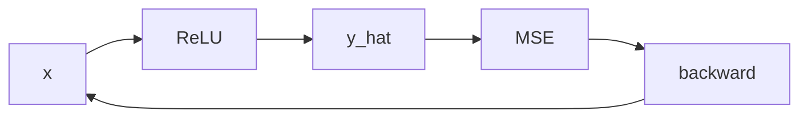

# 03.NumPy手写训练

下次要看「自己算梯度、更新两层权重」时看这里。

合成回归：`n=32, d_in=8, hidden=16`，隐藏层 ReLU，200 步。固定 seed。

## 前置条件

- Python 3.10+，先 `pip install -r exampleNeuralNetwork/requirements.txt`（只要 numpy）
- 不读 `.env`，不调模型

## 使用方法

```bash
npm run nn:numpy-train
```

控制台打印规模，以及第 0 步和最后一步的 MSE。最后一步应明显小于第 0 步。



## 目录架构

```text
03.NumPy手写训练/
  main.py    前向 + 反传 + 打印首尾 loss
```

## 查阅要点

- does: 手写 ReLU 反传；合成数据；只打首尾 loss
- not: 不画曲线；不读 housing.csv；不是 Keras（那是 04）
