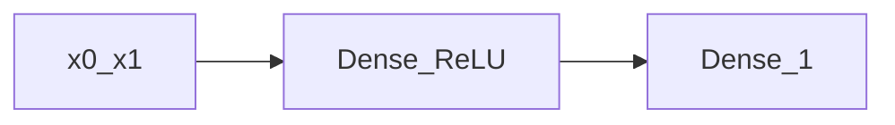

# 04.Keras最小回归

下次要用 Keras `Sequential` 做最小回归时看这里。

合成目标 `y = 2*x0 + 0.5*x1 + 噪声`。一层 ReLU 隐层，再接到一个输出。

## 前置条件

- Python 3.10+，先 `pip install -r exampleNeuralNetwork/requirements.txt`（本目录需要 tensorflow）
- 不读 `.env`，不调外部模型服务

## 使用方法

```bash
npm run nn:keras
```

控制台打印第 1 个和最后一个 epoch 的 MSE。最后一步应明显小于第一步。不保存模型文件。



## 目录架构

```text
04.Keras最小回归/
  main.py    合成数据 + Sequential.fit
```

## 查阅要点

- does: Keras Sequential；合成回归；只打首尾 loss
- not: 不保存 .keras；不读 housing.csv；不是手写梯度（那是 03）
