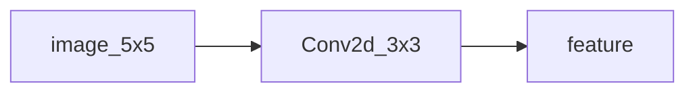

# 05.CNN卷积演示

下次要看「一张小图过一层 Conv2d」时看这里。

5×5 合成灰度图，固定 3×3 核，打印输出张量。不画图。

## 前置条件

- Python 3.10+，先 `pip install -r exampleNeuralNetwork/requirements.txt`（本目录需要 `torch`）
- 不读 `.env`，不读真实图片

## 使用方法

```bash
npm run nn:cnn-conv
```

控制台打印输入 shape、卷积核和 3×3 输出。



## 目录架构

```text
05.CNN卷积演示/
  main.py    合成图 + Conv2d 一次前向
```

## 查阅要点

- does: 固定核卷积；打印张量
- not: 不画图；不是多 filter / 池化（那是 06）
