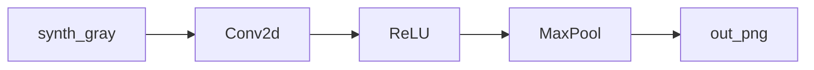

# 06.CNN特征图

下次要看 Conv → ReLU → MaxPool 各层特征图时看这里。

numpy 生成小灰度图，四个固定 4×4 filter。图保存到 `out/`，不弹窗。

## 前置条件

- Python 3.10+，先 `pip install -r exampleNeuralNetwork/requirements.txt`（需要 `torch`、`matplotlib`）
- 不读 `.env`，不依赖 OpenCV / 故宫.jpg

## 使用方法

```bash
npm run nn:cnn-viz
```

控制台打印各层 shape；`out/input.png`、`conv.png`、`relu.png`、`pool.png` 为生成物，不入库。



## 目录架构

```text
06.CNN特征图/
  main.py    合成图 + 四 filter + savefig
  out/       生成物（不入库）
```

## 查阅要点

- does: 多 filter 特征图；落盘 png
- not: 不 plt.show；不是 YOLO（那是 07 / 08）
