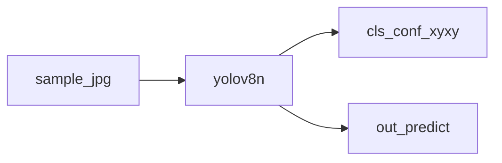

# 07.YOLO预测

下次要用 ultralytics 预训练模型做目标检测时看这里。

`yolov8n.pt`（首次自动下载）对 `sample.jpg` 出框。控制台打印类别 / 置信度 / xyxy。

## 前置条件

- Python 3.10+，先 `pip install -r exampleNeuralNetwork/requirements.txt`（需要 `ultralytics`、`torch`）
- 首次会下载权重；不读 `.env`

## 使用方法

```bash
npm run nn:yolo-predict
```

控制台列出检出框；标注图写到 `out/predict/`（不入库）。不弹窗。



## 目录架构

```text
07.YOLO预测/
  main.py      YOLO.predict + 打印框
  sample.jpg   示例图
  out/         生成物（不入库）
```

## 查阅要点

- does: 预训练检测；控制台打框
- not: 不训练（那是 08）；不挂钢缺陷全量数据
