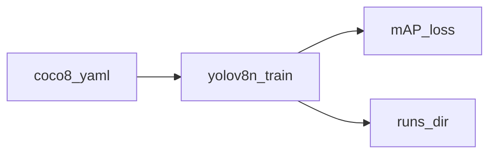

# 08.YOLO训练

下次要跑一轮最小 YOLO 训练时看这里。

`yolov8n` + ultralytics 自带 `coco8.yaml`（约 8 张，可自动下载），CPU、1 epoch。

## 前置条件

- Python 3.10+，先 `pip install -r exampleNeuralNetwork/requirements.txt`（需要 `ultralytics`、`torch`）
- 首次会下载权重和 coco8；不读 `.env`
- 不需要课机上的 COCO 20GB / 钢缺陷数据

## 使用方法

```bash
npm run nn:yolo-train
```

控制台打印训练日志和 mAP / loss 摘要；`runs/` 为生成物，不入库。



## 目录架构

```text
08.YOLO训练/
  main.py    train 1 epoch on coco8
  runs/      生成物（不入库）
```

## 查阅要点

- does: 最小 train；coco8；CPU 一 epoch
- not: 不训钢缺陷；不从 yolov12.yaml 从零训大模型
